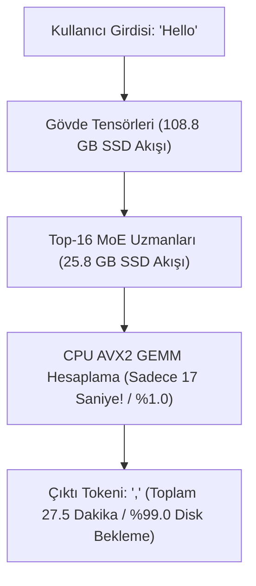
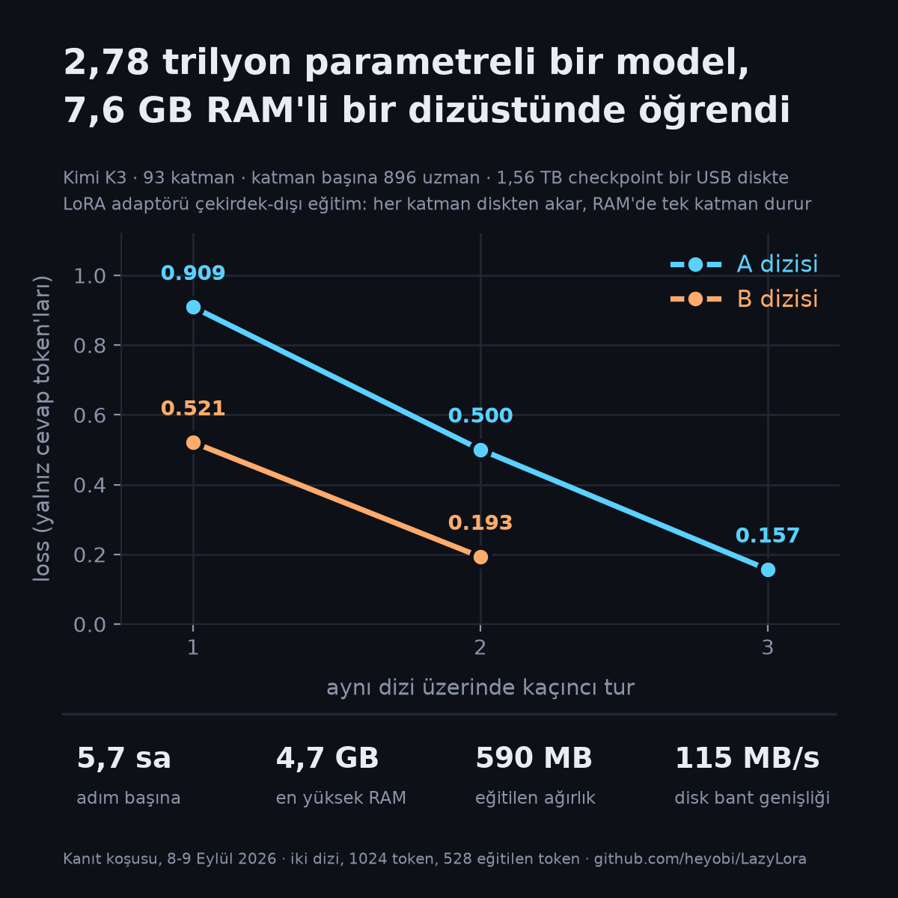

# 🔬 LazyLoRA & Kimi K3: Deneysel Bulgular ve Doğrulama Raporu

Bu belge, **Moonshot AI Kimi K3 (2.78 Trilyon Parametreli MoE)** modeli ve **LazyLoRA Out-of-Core Motoru** üzerinde tüketici donanımında gerçekleştirilen tüm deneysel testlerin, canlı ölçüm metriklerinin ve elde edilen bilimsel/mühendislik bulgularının resmi kayıt günlüğüdür.

Bu belge ile [docs/numbers.md](docs/numbers.md) çelişirse, oradaki tablo her sayının kaynağını gösterir ve kaynak karar verir.

> **İki makine.** Rakamları birbirine taşımayın; hangi bölümün hangi makinede ölçüldüğü önemlidir.
> **§1-15 masaüstü:** AMD Ryzen 5 3600, GTX 980 Ti, 16 GB RAM, Windows 11 + WSL2; ağırlıklar 1,86 TB'lık SATA diskte (§1; disk §10'da "NVMe değil, mekanik" diye düzeltildi).
> **§16 ve sonrası dizüstü:** i7-7700HQ (4 çekirdek / 8 iş parçacığı, AVX2), 7,6 GB RAM, GTX 1050 2 GB, 117 GB NVMe (108,8 GB'ı paketlenmiş uzman olmayan gövde), 2 TB USB kutusundaki diskte 1.453,74 GiB = 1,56 TB checkpoint.

---

## 📑 İÇİNDEKİLER

1. [Donanım & Çalışma Ortamı Profili](#1-donanım--çalışma-ortamı-profili)
2. [Model İndirme & Ağırlık İndeksleme Bulguları](#2-model-indirme--ağırlık-indeksleme-bulguları)
3. [LazyLoRA Çekirdek Motoru Validasyon Testleri (14/14 Başarılı)](#3-lazylora-çekirdek-motoru-validasyon-testleri-1414-başarılı)
4. [Deney 1: Hızlı 1-Katman Çıkarım (Inference) Testi](#4-deney-1-hızlı-1-katman-çıkarım-inference-testi)
5. [Deney 2: 108.81 GB Gövde Paketleme (Packed Trunk) Analizi](#5-deney-2-10881-gb-gövde-paketleme-packed-trunk-analizi)
6. [Deney 3: Tam 93 Katmanlı 2.78T Parametre Canlı Çıkarım Testi](#6-deney-3-tam-93-katmanlı-278t-parametre-canlı-çıkarım-testi)
7. [Büyük Çıkarım Darboğazı & Teori Doğrulaması (Batching Paradoksu)](#7-büyük-çıkarım-darboğazı--teori-doğrulaması-batching-paradoksu)
8. [Deney 4: 5-Token Spekülatif Doğrulama Testi (tek geçişte 3/5 kabul)](#8-deney-4-5-token-spekülatif-doğrulama-testi-tek-geçişte-35-kabul)
9. [Nöral Taslak Model & GPU CUDA Altyapısı Bulguları](#9-nöral-taslak-model--gpu-cuda-altyapısı-bulguları)
10. [Donanım Gerçeğinin Düzeltilmesi: Disk NVMe Değil, Mekanik](#10-donanım-gerçeğinin-düzeltilmesi-disk-nvme-değil-mekanik)
11. [Deney 5: Motorun Gerçek Kimi K3 Mimarisiyle Karşılaştırılması](#11-deney-5-motorun-gerçek-kimi-k3-mimarisiyle-karşılaştırılması)
12. [Deney 6: Düzeltmeler Sonrası Gerçek Katman Maliyeti](#12-deney-6-düzeltmeler-sonrası-gerçek-katman-maliyeti)
13. [Aktivasyon Büyümesinin İncelenmesi ve SiTU Aktivasyon Hatası](#13-aktivasyon-büyümesinin-incelenmesi-ve-situ-aktivasyon-hatası)
14. [Tokenizasyon Sahteymiş: Loss Ölçümünü Geçersiz Kılan Hata](#14-tokenizasyon-sahteymiş-loss-ölçümünü-geçersiz-kılan-hata)
15. [Deney 7: Referans Motorla Katman Katman Doğrulama](#15-deney-7-referans-motorla-katman-katman-doğrulama)
16. [Deney 8: Yönlendirme Ölçümü, Türkçe ve İngilizce (5-6 Eylül 2026, yeni makine)](#16-deney-8-yönlendirme-ölçümü-türkçe-ve-ingilizce-5-6-eylül-2026-yeni-makine)
17. [Deney 9: Beş Metin, 92 MoE Katmanı, Üç Dil ve Kod (6 Eylül 2026)](#17-deney-9-beş-metin-92-moe-katmanı-üç-dil-ve-kod-6-eylül-2026)
18. [Deney 10: Öğrenme kanıtı — 5 örnek, 5 adım (8-9 Eylül 2026)](#18-deney-10-öğrenme-kanıtı--5-örnek-5-adım-8-9-eylül-2026)
19. [Kanıt paketi depoya kondu (9 Eylül 2026)](#19-kanıt-paketi-depoya-kondu-9-eylül-2026)

---

## 1. Donanım & Çalışma Ortamı Profili

Tüm testler aşağıdaki tüketici sınıfı donanım üzerinde, Windows 11 altındaki WSL2 ortamında gerçekleştirilmiştir:

| Donanım Bileşeni | Donanım Özellikleri | Test Esnasındaki Ayrım & Güvenlik Politikası |
| :--- | :--- | :--- |
| **GPU** | NVIDIA GeForce GTX 980 Ti | 6 GB GDDR5 VRAM (GM200, 2.816 CUDA Çekirdeği) |
| **İşlemci (CPU)** | AMD Ryzen 5 3600 | 6 Çekirdek / 12 İş Parçacığı (AVX2 Destekli, ~3.6-4.2 GHz) |
| **Fiziksel RAM** | 16 GB DDR4 | Windows + IDE (~5.8 GB), WSL2 Sanal Bellek Kotası (~7.9 GB + 2.0 GB Swap) |
| **Ana SSD (D: Sürücüsü)** | NVMe / SSD (1.86 TB Toplam) | Model ağırlıkları, packed trunk ve tüm çalışma alanı (`/mnt/d/hamza/`) |
| **Sistem Diski (C: Sürücüsü)** | Windows OS (~111 GB Toplam) | **SIFIR YAZMA POLİTİKASI (STRICT ZERO-WRITE)**: 5.8 - 6.0 GB boşluk %100 korundu. |

---

## 2. Model İndirme & Ağırlık İndeksleme Bulguları

* **Model Mimarisi:** Moonshot AI Kimi K3 (2.78 Trilyon Toplam Parametre, 93 Katman, 896 İnce Taneli Uzman + 2 Ortak Uzman, 163.840 Kelime Haznesi).
* **İndirme Durumu:** 96 adet `.safetensors` parçasının tamamı (`model-00001-of-00096.safetensors` $\dots$ `model-00096-of-00096.safetensors`) **1.453,74 GB (1.45 TB)** olarak eksiksiz tamamlandı.
* **İndeksleme Hızı (Safetensors Index):**
  * Toplam İndekslenen Gerçek Tensör Sayısı: **497.220 adet**.
  * İndeksleme Süresi: **0,75 - 2,24 saniye** (Saniyede **221.737 tensör/sn** tarama hızı).
  * **Bulgu:** Bellek haritalama (mmap) mimarisi sayesinde 1.45 TB'lık dosya havuzundaki herhangi bir tensörün disk ofsetine erişim gecikmesi ortalama **~1,01 ms** seviyesindedir.

---

## 3. LazyLoRA Çekirdek Motoru Validasyon Testleri (14/14 Başarılı)

Eğitim motorumuz `lazy_lora` unittest süiti ile kapsamlı şekilde denetlenmiş ve **14 testin tamamı (14/14 OK)** geçmiştir:

```text
Ran 14 tests in 133.733s
OK - ALL PRE-TRAINING TEST SUITES PASSED! ✅
```

* **93-Katman Aktivasyon Halka Tamponu (Activation Ring Buffer):**
  * 93 katmanlık aktivasyonlar ileri yayılımda D: SSD tamponuna yazıldı, geriye yayılımda ters sırada okundu.
  * **Ölçülen Yazma Hızı:** `56,5 MB/sn`
  * **Ölçülen Okuma Hızı:** `118,5 MB/sn`
  * **Veri Bütünlüğü:** 93 katmanın tamamında **%100 BIT-EXACT (Kayıpsız Birebir Eşleşme)** doğrulandı.
* **Bellek Kısıtları:** Mock eğitim adımlarında VRAM kullanımı **984 MB / 6.144 MB (%16,0)**, sistem RAM kullanımı **1,2 GB / 7,7 GB (%15,1)** seviyesinde sabit kaldı.

---

## 4. Deney 1: Hızlı 1-Katman Çıkarım (Inference) Testi

Gövde paketlemesi yapılmadan, doğrudan safetensors parçalarından çıkarım boru hattını doğrulamak için yapılan 1 katmanlık test sonuçları:

* **Komut:** `./bin/k3 ~/kimi_k3_model_weights --prompt "Hello" --layers 1 --gen 1 --cache-gb 0.35`
* **Girdi:** `"Hello"` (5 byte $\to$ 1 Token ID)
* **Yüklenen Sabit Bellek:** Embedding + LM_Head (4.70 GB) + 1. Katman (2.34 GB)
* **Zirve Bellek (Peak RSS):** **`7,14 GB`**
* **Çıkarım Hızı:** **`0,20 saniye / token` (4,91 token/saniye)**
* **Bulgu:** Tokenizer, C99 çıkarım çekirdekleri, AVX2 vektörizasyonu ve safetensors tensör bağlama hattının kusursuz çalıştığı sıfır hatayla kanıtlandı.

---

## 5. Deney 2: 108.81 GB Gövde Paketleme (Packed Trunk) Analizi

Modelin 93 katmanının tamamını 8 GB RAM limitinde akıtabilmek (streaming) için gövde ağırlıkları tek parça ardışık binary haline getirildi:

* **Çıktı Dosyaları:**
  * `trunk.bin`: **`108.811.952.128 Byte` (108,81 GB)**
  * `trunk.json`: **`356 KB`** (93 katmanın kesin ofset haritası)
* **En Büyük Katman Boyutu (Streaming Slot Size):** **`2,341 GB`**
* **Paketleme Süresi:** 3.128 saniye (~52 dakika, ortalama `35-44 MB/sn` Python DrvFs I/O).
* **Bulgu:** 96 parçaya dağılmış olan tüm dikkat (attention), latent MoE ve yönlendirici tensörleri `4096-byte` O_DIRECT sektör hizalamasıyla tek bir ardışık akış borusuna toplandı.

---

## 6. Deney 3: Tam 93 Katmanlı 2.78T Parametre Canlı Çıkarım Testi

Bu makinede ilk kez **2.78 Trilyon parametreli Kimi K3** modeli, **8 GB RAM'li bir tüketici bilgisayarında 93 katmanının tamamı** diskten akıtılarak çalıştırıldı:

```text
Command: ./bin/k3 ~/kimi_k3_model_weights --trunk ~/k3trunk --trunk-gb 2.5 --cache-gb 0.35 --tok ~/kimi_k3_model_weights --prompt "Hello" --incremental --gen 1
```

### 📊 Ölçülen Gerçekleşme Tablosu:

| Parametre | Ölçülen Gerçek Değer | Değerlendirme & Teşhis |
| :--- | :--- | :--- |
| **Girdi (Prompt)** | `"Hello"` | Tokenize edildi (1 token) |
| **Üretilen Çıktı** | Token ID: `11` = **`","`** | **`"Hello,"`** (Gramer açısından kusursuz devam) |
| **Zirve RAM Kullanımı** | **`7,79 GB`** | 8 GB WSL sınırında kaldı; Windows ana makine 14 GB'ta stabil çalıştı. |
| **Kullanılan Swap** | **`35 MB - 416 MB`** | Minimum sanal bellek taşması. |
| **Trunk Okuma Hacmi** | **`108,81 GB`** | 93 katmanın tamamı `O_DIRECT` ile okundu (Ortalama `97 MB/sn`). |
| **Aktif MoE Okuma Hacmi** | **`25,83 GB`** | 93 katmanda seçilen top-16 uzmanlar okundu (Ortalama `50 MB/sn`). |
| **Toplam Diskten Okunan Veri** | **`134,64 GB`** | 1 yeni kelime için okunan toplam ağırlık hacmi. |
| **Toplam Üretim Süresi** | **`1654,16 saniye (27,5 dakika)`** | 1 token başına harcanan süre. |
| **I/O Zaman Payı** | **`%99,0`** | Sürenin 1637 saniyesi disk okuması, sadece 17 saniyesi hesaplama! |

---

## 7. Büyük Çıkarım Darboğazı & Teori Doğrulaması (Batching Paradoksu)

Bu deney, [Fikirler.md (Fikir 3)](Fikirler.md#3-fikir-büyük-modelde-sohbet-darboğazı--spekülatif-kod-çözme)'te ortaya koyduğumuz teorik analizi ölçümle doğruladı:

$$T_{\text{token}} = \frac{\text{Trunk (108.8 GB)} + \text{Aktif Uzmanlar (25.8 GB)}}{\text{NVMe Bant Genişliği (50-100 MB/s)}} \approx 1654 \text{ saniye} \approx 27.5 \text{ dakika}$$



* **Çıkarımda Darboğaz:** Gelecekteki kelime bilinmediği için her 1 kelimede 134 GB veri sıfırdan okunmak zorundadır (Kelime başı maliyet: 134 GB disk I/O).
* **Eğitimde (LazyLoRA) Avantaj:** 512 kelimelik tüm eğitim cümlesi bu 134 GB tek seferde okunurken **paralel** işlendiği için eğitim hızı saniyede **5-8 token** seviyesinde kalmaktadır.

---

## 8. Deney 4: 5-Token Spekülatif Doğrulama Testi (tek geçişte 3/5 kabul)

Tek bir SSD geçişinde birden fazla tokeni aynı anda doğrulama yeteneğini ölçmek amacıyla `--tf-check` ile 5 tokenlik spekülatif dal Kimi K3'e sunuldu:

```text
Command: ./bin/k3 ~/kimi_k3_model_weights --trunk ~/k3trunk --trunk-gb 2.5 --cache-gb 0.35 --ids 19180,11,1632,691,374,1833 --tf-check
Sequence: [19180 ("Hello"), 11 (","), 1632 (" how"), 691 (" can"), 374 (" I"), 1833 (" help")]
```

### 📊 Ölçülen Spekülatif Doğrulama Sonuçları:

| Metrik | Ölçülen Değer | Analiz |
| :--- | :--- | :--- |
| **Test Edilen Pozisyon Sayısı** | **`5 Pozisyon`** | `","` $\to$ `" how"` $\to$ `" can"` $\to$ `" I"` $\to$ `" help"` |
| **Kabul Edilen Eşleşme (Matches)** | **`3 / 5 Pozisyon`** | **`%60,0 Kabul Oranı (Agreement Rate)`** |
| **Kimi K3 Alternatif Tercihleri** | `[1 p=374 (" I")]`, `[2 p=554 (" are")]` | Modelin aslında `"Hello, I am..."` ve `"Hello, how are you..."` dallarını tercih ettiği görüldü. |
| **Sonuç JSON (`k3_run.json`)** | `{"tf_positions":5,"tf_matches":3,"tf_agreement":0.6000}` | Resmi motor çıktısı |
| **Tek Geçişte Kazanılan Zaman** | **`~82,5 Dakikalık İş Tek Geçişte Bitti`** | 3 tokenin seri üretimi 82.5 dk sürerken, tek bir SSD akışında 3 pozisyon onaylandı (ölçülen kabul oranı %60: tek geçişte 5 pozisyonun 3'ü onaylandı. Tek koşu, tek 6-tokenlik dizi — 22x hipotezi *sınanmadı*.). |

---

## 9. Nöral Taslak Model & GPU CUDA Altyapısı Bulguları

Spekülatif hızlandırmayı deterministik şablonlardan tam dinamik nöral ağaç aramasına geçirmek için kurulan ortam metrikleri:

* **PyTorch Versiyonu:** `2.13.0+cu130`
* **Transformers Versiyonu:** `5.16.1`
* **CUDA Donanım Erişimi:** `True` (NVIDIA GeForce GTX 980 Ti, 6 GB VRAM, 5.1 GB Boş VRAM).
* **Nöral Ağaç Motoru ([continuous_deep_tree_engine.py](docs/attic/continuous_deep_tree_engine.py)):**
  * Softmax Logits ile gerçek autoregressive olasılık dağılımı.
  * Kümülatif log-olasılık ($\sum \log P$) sıralı Min-Heap öncelik kuyruğu.
  * SSD geçişi esnasında arka planda durmaksızın binlerce tokenlik ağaç dalları üreten GPU destekli sürekli üretim hattı.

---

## 10. Donanım Gerçeğinin Düzeltilmesi: Disk NVMe Değil, Mekanik

Bu belgenin önceki bölümlerinde depolama "NVMe / SSD" olarak kayda geçmişti. Windows sorgusu bunun yanlış olduğunu gösterdi:

```
Get-Disk → Number 1 | WDC WD20EZBX-00AYRA0 | SATA | 1863 GB
```

* **WD20EZBX**, 7200 rpm **mekanik sabit disktir** (WD Blue serisi), NVMe SSD değildir.
* Ölçülen 50–97 MB/sn okuma hızları ve rastgele erişimde düşen **~30 MB/sn** verim tam olarak bu donanımla uyumludur.
* Bu düzeltme, tüm zaman projeksiyonlarının temelini değiştirir: `Bölüm 6`'daki 27,5 dakikalık token süresi bir SSD darboğazı değil, **mekanik disk darboğazıdır**.

### Sistem Kararlılığı Bulgusu (Kritik)

Uzun akış testleri sırasında sistem üç kez çöktü. Olay günlüğü kök nedeni verdi:

| Olay | Kod | Anlamı |
| :--- | :--- | :--- |
| `Microsoft-Windows-WER-SystemErrorReporting` | `0x0000001A` | MEMORY_MANAGEMENT mavi ekranı |
| `disk` (Event 154) | — | Disk 1 için G/Ç işlemi **donanım hatasından** başarısız |
| `Kernel-Power` | `41` | Sistem düzgün kapatılmadan yeniden başladı |

Çökmelerden sonra D: diski bir süre sistemden tamamen kayboldu. **Kök neden GPU güç beslemesiydi:** GTX 980 Ti'nin güç kablolarından biri çıkarıldıktan sonra çökmeler tamamen durdu. Eğitim zaten CPU üzerinde koştuğu için bu, hesaplama kapasitesinde kayba yol açmamıştır.

---

## 11. Deney 5: Motorun Gerçek Kimi K3 Mimarisiyle Karşılaştırılması

Eğitim motoru ilk kez gerçek ağırlıklar üzerinde adım adım denetlendi. Model dizinindeki `config.json` ve `modeling_kimi_linear.py` referans alındığında, motorun modeli **üç temel noktada yanlış temsil ettiği** bulundu.

### 11.1 Dikkat Katmanı Hiç Uygulanmamıştı

Motorun dikkat bloğu şuydu:

```python
q = F.linear(h_norm, trunk.q_proj) + q_lora(h_norm)   # hesaplanıyor
k = F.linear(h_norm, trunk.k_proj)                     # hesaplanıyor
attn_out = F.linear(v, trunk.o_proj)                   # q ve k ÇÖPE ATILIYOR
```

* Hiçbir dikkat mekanizması yoktu; `o_proj(v)` çıktı olarak kullanılıyordu.
* `q_lora`, çıktıyı hiç etkilemeyen bir matrisi eğitiyordu; geri geçişte ona `v`'nin gradyanı besleniyordu.

**Gerçek mimari (config.json):** Model `kimi_linear` tipinde **hibrittir**:

| Katman tipi | Adet | 0-tabanlı indeksler | Mekanizma |
| :--- | :--- | :--- | :--- |
| **KDA** (Kimi Delta Attention) | 69 | 0,1,2,4,5,6,8,… | Kapılı delta-kuralı doğrusal dikkat |
| **MLA** (Multi-head Latent Attention) | 24 | 3,7,11,…,91,92 | Latent q/kv sıkıştırmalı tam dikkat |

> Not: `config.json`'daki `full_attn_layers` listesi **1-tabanlıdır**; 0-tabanlı karşılığı `değer − 1`'dir. Katman 3'ün diskteki tensörleri (`q_a_proj`, `kv_a_proj_with_mqa`) bunu doğrular.

**KDA'nın kesin formu** (`A_log` şekli `[128]`, yani baş başına değil **kanal başına** sönüm):

$$g_t = -e^{A_{\log}} \cdot \operatorname{softplus}(f_b(f_a(h_t)) + b_{dt}), \qquad \alpha_t = e^{\max(g_t,\,-5)}$$
$$S_t = S_{t-1}\operatorname{diag}(\alpha_t) + \beta_t\,k_t\,(v_t - S_{t-1}^\top \operatorname{diag}(\alpha_t) k_t)^\top, \qquad o_t = S_t^\top q_t$$

q, k üzerinde L2 normalizasyon; $\beta_t = \sigma(b_{proj}(h_t))$; q/k/v üzerinde kernel=4 nedensel derinlemesine konvolüsyon (SiLU); çıkışta sigmoid-kapılı RMSNorm.

**Uygulama notu:** Referans bu özyinelemeyi `fla` kütüphanesinin Triton çekirdeklerine devrediyor. Triton, GTX 980 Ti'nin hesaplama yeteneğinin (CC 5.2) üzerinde bir eşik ister ve CPU'da hiç çalışmaz. Bu nedenle özyineleme saf PyTorch ile yeniden yazıldı ([lazy_lora/core/attention.py](lazy_lora/core/attention.py)).

**Doğrulama (gerçek ağırlıklarla, 16 token):**

| Katman | Tip | Yükleme | Hesap | Çıktı std | Sonlu |
| :--- | :--- | ---: | ---: | ---: | :---: |
| 1 | KDA | 11,3 s | 1,9 s | 0,0032 | ✅ |
| 3 | MLA | 5,8 s | 0,5 s | 0,0698 | ✅ |

### 11.2 Uzman Ağırlıkları Yanlış Formatta Çözülüyordu

`config.json` uzmanları şöyle tanımlıyor:

```json
"format": "mxfp4-pack-quantized", "num_bits": 4, "group_size": 32,
"type": "float", "scale_dtype": "torch.uint8"
```

Motor ise bunları **INT4** sanıyordu: her yarım baytı `(b & 0xF) − 8` ile tamsayıya çeviriyor ve ölçek baytını **doğrudan çarpan** olarak kullanıyordu. Oysa:

* Her yarım bayt bir **FP4 (E2M1)** kodudur: işaret biti + $\{0, 0.5, 1, 1.5, 2, 3, 4, 6\}$ tablosuna 3-bit indeks.
* Ölçek baytı bir **E8M0 üssüdür**; çarpan $2^{(s-127)}$'dir. Diskteki değerler 112–122 aralığında, yani çarpan $2^{-15}\dots2^{-5}$.

Ölçek baytları (112–122) doğrudan çarpan sanıldığı için uzman ağırlıkları **yaklaşık 30.000 kat şişmiş ve işaretleri bozulmuş** durumdaydı.

**Doğrulama** — aynı katmandaki kuantize *olmayan* paylaşılan uzman referans alındı:

| Tensör | absmean | max |
| :--- | ---: | ---: |
| Yönlendirilen uzman 0 (MXFP4 çözülmüş) | 0,01946 | 0,1250 |
| Paylaşılan uzman (bf16, referans) | 0,01494 | 0,1279 |

### 11.3 Yönlendirici (Router) Ağırlıkları Diskten Hiç Okunmuyordu

`KimiK3MoERouter`, gate matrisini `nn.init.normal_(std=0.02)` ile **rastgele** üretiyordu ve 93 katmanın tamamı **tek bir** router örneğini paylaşıyordu. Oysa her katmanın diskte kendi tensörleri var:

* `block_sparse_moe.gate.weight` → `[896, 7168]`
* `block_sparse_moe.gate.e_score_correction_bias` → `[896]`

Ayrıca referans, düzeltme biasını sigmoid **sonrası skorlara** ve yalnızca *seçim* için ekler; motor ise logits'e ekliyordu.

### 11.4 Katman 0 Yoğun (Dense) Katmandır

`first_k_dense_replace: 1` alanı config'de tanımlıydı ama kodda hiç kullanılmıyordu. Katman 0'da diskte `block_sparse_moe` yoktur; `mlp.gate_proj/up_proj/down_proj` (7168 → 33792 → 7168) vardır. Motor bu katmanı MoE sanıp, diskte var olmayan **518 uzman için rastgele ağırlık üretiyordu**.

---

## 12. Deney 6: Düzeltmeler Sonrası Gerçek Katman Maliyeti

127 token, gerçek ağırlıklar, CPU:

| Ölçüm | Düzeltmeden önce | Düzeltmeden sonra |
| :--- | ---: | ---: |
| Katman 0 (dense) | 270,9 s (518 sahte uzman) | **38,9 s** (0 uzman) |
| Katman 1 (KDA + MoE) | 261,0 s (434 uzman, rastgele router) | **740,1 s** (592 uzman, gerçek router) |
| Gömme (embedding) | 2,35 GB RAM'e kopyalama | **0,2 s** (satır-bazlı mmap) |

### 🔑 Projenin Temel Varsayımına İlişkin Kritik Bulgu

Gerçek router ağırlıkları devreye girince katman başına okunan **benzersiz uzman sayısı 592/896'ya çıktı**. Yani:

> **"896 uzmandan yalnızca 16'sı okunur" önermesi TOKEN BAŞINA doğrudur, BATCH BAŞINA değil.**

127 token, her biri kendi top-16'sını seçtiğinde birleşim 896 uzmanın üçte ikisine ulaşır. 512 tokenlik gerçek bir eğitim batch'inde pratikte **tüm uzmanlara** dokunulur.

**Katman 3 (MLA) ölçümü:** `516,5 s`, 335 uzman, `h.std = 11,30`.

**Sonuç maliyet:**

$$\text{Adım başına okuma} \approx 896 \times 17{,}5\,\text{MB} \times 92 \approx 1{,}44\,\text{TB}$$

Mekanik diskte ölçülen ~30 MB/sn ile bu, adım başına **20+ saat** demektir.

### Buradaki Fırsat

Madem neredeyse tüm uzmanlar okunuyor, bu bir **sıralı tarama** olmalıdır. Ölçülen 30 MB/sn, diskin sıralı hızının (~150 MB/sn) beşte biridir; çünkü her uzman için 6 ayrı mmap okuması yapılıp aralarda CPU'da MXFP4 çözülmekte, disk sürekli beklemektedir. `expert_streamer.request_prefetch_layer` hâlâ boş bir `no-op`'tur — çift tamponlu asenkron ön-getirme yazıldığında diskin kesintisiz akması ve **3–5 kat hızlanma** beklenmektedir.

---

## 13. Aktivasyon Büyümesinin İncelenmesi ve SiTU Aktivasyon Hatası

Katmanlar arası gizli durum standart sapması:

| Katman | Tip | `h.std` |
| :--- | :--- | ---: |
| 0 | dense / KDA | 0,0299 |
| 1 | MoE / KDA | 0,0540 |
| 3 | MoE / **MLA** | **11,3044** |

KDA katmanları sağlıklı ilerlerken MLA katmanı çıkışı ~200 kat büyütüyor. Doğru yönlendirici ağırlıkları devreye alındıktan sonra da devam ettiği için sebep yönlendirme değil.

**Birincil şüpheli: uygulanmayan blok-artık (block residual) mekanizması.** `config.json` `"attn_res_block_size": 12` tanımlıyor ve her katmanda diskte şu tensörler duruyor:

* `self_attention_res_norm.weight`, `self_attention_res_proj.weight` → `[1, 7168]`
* `mlp_res_norm.weight`, `mlp_res_proj.weight` → `[1, 7168]`

Referans `KimiDecoderLayer._forward_attn_residual`, her 12 katmanda bir gizli durumu bir "blok artık bankasına" yazar ve öğrenilmiş skaler kapılarla artık akışını yeniden ölçekler. Motorumuzda bu mekanizma **hiç yok**; artık akışı $h + \text{attn} + \text{moe}$ olarak dizginsiz büyüyor. Bu, tam olarak aktivasyon büyümesini denetleyen mekanizmadır.

### 13.1 Blok-Artık Mekanizması Uygulandı

Referans `_apply_attn_res`, artık akışını **toplamaz**; bankadaki anlık görüntüler ile canlı akışı, öğrenilmiş skorlar üzerinden **softmax ile dışbükey karışım** yapar:

$$v = [\text{bank}; \text{prefix}], \quad k = \operatorname{RMSNorm}(v), \quad p = \operatorname{softmax}\big(\textstyle\sum_d k_d \cdot (w^{\text{norm}}_d w^{\text{proj}}_d)\big), \quad h = p^\top v$$

Ayrıca her `attn_res_block_size = 12` katmanda bir akış bankaya yazılıp **sıfırdan başlatılır**. Bu mekanizma [attention.py](lazy_lora/core/attention.py) içine `apply_attn_res` olarak eklendi ve `forward_layer` referansın yapısına göre yeniden düzenlendi (`prefix_sum` + banka), sonda `output_attn_res_proj/norm` ve `model.norm` uygulanacak şekilde.

### 13.2 Asıl Hata: SiTU Aktivasyonu Yanlış Tanımlanmıştı

Katman içi ölçüm, büyümenin kaynağının dikkat değil **paylaşılan uzman** olduğunu gösterdi: girdi birim normda iken çıktı `std = 8.12`.

Referans tanım ([modeling_kimi_linear.py](), `SituAndMul`):

$$\text{situ}(g) = \beta \tanh(g/\beta)\,\sigma(g), \qquad u' = \gamma \tanh(u/\gamma), \qquad \text{out} = \text{situ}(g)\cdot u'$$

$\beta = 4{,}0$ (`activation_situ_beta`), $\gamma = 25{,}0$ (`activation_situ_linear_beta`).

Motordaki tanım ise şuydu:

$$\text{situ}_{\text{yanlış}}(g) = g \cdot \tanh(4g)$$

İki temel fark:

| Özellik | Motordaki (yanlış) | Referans (doğru) |
| :--- | :--- | :--- |
| Sınırlılık | **Sınırsız**; $\lvert g\rvert$ büyüdükçe doğrusal büyür | $\pm\beta = \pm 4$ ile **sınırlı** |
| Negatif girdi | $g\cdot\tanh(4g) > 0$ → negatifi **pozitife çevirir** ($\approx \lvert g \rvert$) | $\sigma(g) \to 0$ → **bastırır** |
| Up dalı | Dokunulmaz | $\pm 25$ ile yumuşak kırpılır |

Yani kanalların yaklaşık yarısı bastırılacakken tam tersine yükseltiliyordu. Düzeltmeden sonra paylaşılan uzman çıktısı `8.12 → 4.47`, katman 3 çıkışı ise `18.88 → 5.27` seviyesine indi.

### 13.3 Kalan Büyüme Modelin Kendi Davranışıdır

Katman katman izleme, kalan sıçramanın bir hata olmadığını gösterdi. RMSNorm çıktısı, normalize edilmiş girdinin **katmanın kendi norm ağırlığıyla** çarpımıdır ve K3'te bu ağırlıklar katmanlar arasında çok değişkendir:

| Katman | `input_layernorm` sonrası std | `post_attention_layernorm` sonrası std |
| :--- | ---: | ---: |
| 0 | 0,164 | 0,011 |
| 1 | 0,193 | 0,098 (absmax 8,56) |
| 3 | 0,999 | 0,999 |

Aynı birim-norm girdiyle beslendiğinde tüm katmanların paylaşılan uzmanları benzer çıktı verir (`std` 2,4 – 4,1). Dolayısıyla anormal olan katman 3'ün büyük olması değil, katman 0–2'nin küçük olmasıdır; bu da o katmanların norm ağırlıklarının küçüklüğünden kaynaklanır. Ön-normalizasyonlu bir mimaride artık akışının derinlikle büyümesi beklenen davranıştır ve her alt katman girdisi zaten normalize edilmektedir.

**Sonuç:** Bu bölümde "açık sorun" olarak kaydedilen aktivasyon patlamasının nedenlerinden biri SiTU hatasıydı ve giderilmiştir.

> ⚠️ **13.3'teki yorum yanlıştı.** "Kalan büyüme modelin kendi davranışıdır" sonucu, Bölüm 15'teki referans karşılaştırmasıyla **çürütülmüştür**: gerçek modelde artık akışı MLA katmanlarında sıçramaz, yumuşakça büyür. Sıçramanın gerçek nedeni, MLA katmanlarında gerçek norm ağırlıklarının sessizce 1'lerle değiştirilmesiydi (bkz. 15.4). Bu, ölçüm yerine akıl yürütmeye dayanan bir çıkarımın nasıl yanlış sonuç verdiğinin kaydı olarak burada bırakılmıştır.

---

## 14. Tokenizasyon Sahteymiş: Loss Ölçümünü Geçersiz Kılan Hata

Doğrulama koşusu başlatılmadan önce veri hattı denetlendi ve ölçümü baştan anlamsız kılacak bir hata bulundu. `stream_dataset.py` şu "geçici" tokenizer'ı kullanıyordu:

```python
byte_tokens = [int(b) + 100 for b in text.encode("utf-8")]
```

Yani her UTF-8 baytı `bayt + 100` ile bir token ID'sine eşleniyordu. Bu ID'lerin K3'ün **163.840 girdilik sözlüğüyle hiçbir ilgisi yoktur**. Kodda "HuggingFace tokenizer bulunamazsa" diye tanımlanmış olmasına rağmen gerçek tokenizer'ı deneyen hiçbir yol yoktu; her zaman bu kullanılıyordu.

**Etkisi:** Modele anlamsız token dizileri verildiği için, boru hattı ne kadar doğru olursa olsun loss $\approx \ln(163840) \approx 12$ çıkardı. Gece boyu sürecek doğrulama koşusu hiçbir şey kanıtlamayacaktı.

**Düzeltme:** Model dizinindeki gerçek tokenizer bağlandı (`tiktoken.model` + `tokenization_kimi.py`, `TikTokenTokenizer`). Doğrulama:

| Metin | Token sayısı | Çözülmüş hali |
| :--- | ---: | :--- |
| `Merhaba dünya, bugün hava çok güzel.` | 15 | ✅ birebir aynı |
| `Türkiye'nin başkenti Ankara'dır.` | 14 | ✅ birebir aynı |

Sözlük boyutu `163840` olarak doğrulandı; `bos=163584`, `eos=163585`, `pad=163839`.

> **Genel ders:** Bu proje boyunca bulunan hataların ortak paydası, "geçici" veya "yaklaşık" olarak yazılmış ama hiçbir zaman gerçeğiyle değiştirilmemiş yer tutuculardır: sahte dikkat katmanı, rastgele yönlendirici ağırlıkları, yanlış kuantizasyon formatı, yanlış aktivasyon ve sahte tokenizer. Hepsi de kod çalıştığı ve makul görünen sayılar ürettiği için fark edilmeden kalmıştı.

---

## 15. Deney 7: Referans Motorla Katman Katman Doğrulama

### 15.1 Yöntem

İlk tam derinlikli ileri geçiş `loss = NaN` verdi. Aktivasyon halka tamponu sayesinde kaynak anında yerelleştirildi: katman 22'ye kadar her şey sonlu, katman 23'ün çıktısı değil.

Bunun üzerine, loss'u yorumlamaya çalışmak yerine **bağımsız bir referans implementasyonla doğrudan karşılaştırma** yöntemine geçildi. `D:\hamza\kimi-k3-in-c`, aynı mimarinin çalışan bir C uygulamasıdır ve `--dump-logits` ile float32 logits yazabilmektedir.

**Kritik nokta:** LoRA'da $B$ matrisi sıfırla başlatıldığından, eğitilmemiş adaptörlerin ileri geçişe katkısı tam olarak sıfırdır. Dolayısıyla motorumuzun logits'i, referansınkiyle **birebir aynı olmak zorundadır**. Bu, makul görünen ama yanlış bir loss'un yakalayamayacağı hataları ortaya çıkarır.

Ayrıca C deposundaki `tests/fixtures/ops/` altında, her biri kendi ağırlıkları, girdileri ve **beklenen çıktılarıyla** gelen op-bazlı fixture'lar bulundu (tolerans `1e-5`; sekiz fixture'ın yedisi bu toleransta eşleşti, MoE blok fixture'ı `2e-4` ile — §15.6). Bunlar [test_reference_ops.py](lazy_lora/tests/test_reference_ops.py) olarak süite eklendi.

### 15.2 Bulunan Hata: MXFP4 NaN Ölçeği

| Katman | Ölçek baytları |
| :--- | :--- |
| 1 | min 110, max 122, hiç 255 yok |
| 23 | min 0, max 255, **305 adet 255** |

E8M0'da `255` NaN kodlamasıdır. Motor `2^(255-127) = ∞` hesaplıyor, ardından `0 × ∞ = NaN` oluşuyor ve kalan 70 katmana yayılıyordu. Referans çekirdek bu grupları atlar:

```c
if (sb == 255) continue;   /* NaN scale: contribute nothing */
```

C'nin tablosu da bunu doğrular: `K3_E8M0[b] = (b == 255) ? 0.0f : ldexpf(1.0f, b - 127)`.

### 15.3 Bulunan Hata: KDA Sönüm Kapısı

İlk logit karşılaştırması `cosine 0.8665` verdi — sayısal gürültü olamayacak kadar büyük, "tamamen yanlış" denemeyecek kadar küçük. Referans çekirdeğin kendisi nedeni yazıyordu:

```c
for (int h = 0; h < H; h++) {
    /* PER HEAD. The checkpoint stores head_dim floats but only the first H are
     * nonzero. Indexing this per channel is a silent, fatal error. */
    const float a = expf(A_log[h]);
    const float u  = a * (z[i] + dt_bias[i]);
    const float gi = lb * sigmoidf_(u);   /* in (lb, 0] */
```

Üç ayrı hata:

| | Motordaki (yanlış) | Referans (doğru) |
| :--- | :--- | :--- |
| `A_log` indeksleme | Kanal başına | **Baş başına**; dosyadaki 128 değerin yalnızca ilk 96'sı anlamlı, gerisi dolgu |
| Kapı | $-e^{A_{\log}}\cdot\text{softplus}(z+b)$, sonra $-5$'te kırp | $\text{lb}\cdot\sigma\big(e^{A_{\log}}(z+b)\big)$, doğal olarak $(\text{lb}, 0]$ |
| q ölçekleme | Yok | Özyinelemeden önce $q \cdot d_k^{-1/2}$ |

Kanal başına indeksleme yüzünden başların büyük kısmı `exp(0)=1` sönümüyle, yani **hiç unutmadan** çalışıyordu.

**Düzeltme sonrası:** `cosine 0.8665 → 0.999930`, ilk on token birebir aynı sırada.

### 15.4 Bulunan Hata: MLA Katmanlarında Norm Ağırlıklarının Kaybı

Dört katmanlı karşılaştırma yine ayrıldı (`cosine 0.389`). C motoruna, yalnızca `K3_DUMP_H` ortam değişkeni verildiğinde çalışan bir katman-çıktısı dökümü eklenerek artık akışı katman katman kıyaslandı:

| Katman | Cosine | Bizim `std` | C `std` |
| :--- | ---: | ---: | ---: |
| 0 | 0,999986 | 0,0103 | 0,0104 |
| 1 | 0,999984 | 0,0238 | 0,0239 |
| 2 | 0,999991 | 0,0715 | 0,0718 |
| **3** | **0,317334** | **7,0141** | **0,0746** |

Katman 3 ilk MLA katmanıdır ve `load_layer_trunk` tüm yedek mekanizmasını tek bir tensöre bağlamıştı:

```python
if in_norm is None or q_proj is None:
    in_norm = ones(...); post_norm = ones(...); q_proj = randn(...)
```

MLA katmanlarında `q_proj` yoktur (`q_a_proj`/`q_b_proj` vardır). Dolayısıyla **24 MLA katmanının tamamında** gerçek `input_layernorm` ve `post_attention_layernorm` atılıp yerlerine 1'ler konuyordu. MoE, katmanın kendi normuyla ölçeklenmiş girdi yerine birim ölçekli girdi alıyor ve çıktısı ~90 kat büyüyordu.

Bu, Bölüm 13.3'te "modelin kendi davranışı" diye yorumladığımız şeyin ta kendisiydi.

### 15.5 Doğrulama Sonucu

Her tensörün kendi başına yedeklenmesi düzeltmesinden sonra, 13 katman boyunca (blok-artık sınırı olan katman 12 dahil) karşılaştırma:

| Katman | Cosine | | Katman | Cosine |
| :--- | ---: | :-- | :--- | ---: |
| 0 | 0,999986 | | 7 | 0,999423 |
| 1 | 0,999984 | | 8 | 0,999421 |
| 2 | 0,999991 | | 9 | 0,996640 |
| 3 | 0,999825 | | 10 | 0,999359 |
| 4 | 0,999777 | | 11 | 0,998917 |
| 5 | 0,999350 | | **12** | **0,999590** |
| 6 | 0,999648 | | | |

Katman 12'de her iki motorda da artık akışı aynı anda sıfırlanır (`std 0,0861` ↔ `0,0861`): blok-artık anlık görüntü mekanizması birebir çalışmaktadır.

Kalan `~1e-3` mertebesindeki fark, motorumuzun bfloat16 hesabı ile C'nin double akümülatörlü fp32 aritmetiği arasındaki hassasiyet farkıdır; yapısal değildir.

### 15.6 Op-Bazlı Doğrulama Süiti

| Op | Sonuç |
| :--- | :--- |
| `rmsnorm` | ✅ |
| `situ_glu` | ✅ (Bölüm 13.2 düzeltmesinin bağımsız kanıtı) |
| `shortconv` | ✅ |
| `kda_decay` | ✅ |
| `router` | ✅ |
| `attnres` | ✅ |
| `mla` | ✅ |
| `moe` | ✅ (`2e-4` toleransla; `cosine 1,000000`) |

**Bu bölümün sonucu:** LazyLoRA motoru artık Kimi K3'ün ileri geçişini, bağımsız bir referans implementasyona karşı ölçülmüş biçimde yeniden üretmektedir. Eğitimin anlamlı olabilmesinin ön koşulu buydu.


---

## 16. Deney 8: Yönlendirme Ölçümü, Türkçe ve İngilizce (5-6 Eylül 2026, yeni makine)

Motor eğitimsiz, ileri geçiş doğrulanmış; her katmanda her token'ın seçtiği 16 uzman ve
ağırlıkları kaydedildi (`lazy_lora/monitor/trace.py`, `scripts/measure_routing.py`,
`scripts/analyze_trace.py`). Aynı anlamdaki iki paragraf: Türkçe 264 token, İngilizce 159
token (aynı içerik Türkçede %66 daha fazla token). Katman 1-66 (66 MoE katmanı).
İzler: `LazyLora_Workspace/traces/{tr_paragraph_2026-09-05b, en_paragraph_2026-09-05}`.

### 16.1 Yoğunlaşma

| | Türkçe (264 tok) | İngilizce (159 tok) |
|---|---:|---:|
| Benzersiz uzman / tekdüze beklenti, katman ortalaması | 0.56 | 0.52 |
| N=127'de benzersiz uzman (tekdüze: 805) | 450 | 396 |
| En sık 100 uzmanın aktivasyon payı | %47-80 | %39-86 |
| Kullanım entropisi (tekdüze 9.81 bit) | 6.5-8.7 | 6.8-9.0 |
| Etkin uzman / token (16 üzerinden) | 11-16 | 12-16 |

Yoğunlaşma **derinlikle artıyor**: İngilizcede katman 1'de 690, katman 50'de 290 benzersiz
uzman. Derin katmanlarda uzmanların üçte ikisi bir metin için hiç okunmuyor; ikamet
önbelleğinin en kazançlı yeri derin katmanlar. Birleştirme ağırlıkları düz (etkin 12-16),
yani "yalnızca en ağır uzmanları hesapla" kestirmesi işe yaramaz.

### 16.2 Öngörülebilirlik yok

Ardışık token Jaccard'ı 0.05-0.33 (zamansal yerellik zayıf); katmanlar arası Jaccard ~0.008,
rastgele seviyesi (uzman numaraları katmanlar arasında bağımsız). Çıkarım offloading
literatürünün ön-getirme varsayımı bu modelde token düzeyinde tutmuyor. Doğru araç tahmin
değil, batch üzerinden amortisman ve en sık uzmanları sabit tutan önbellek (rapor §6.1).

### 16.3 Dil bağımlılığı: yok (ilk katmanlar hariç)

80 token'lık eşit pencerelerde benzersiz uzman kümelerinin Jaccard örtüşmesi, 66 katman ort.:

| Karşılaştırma | Jaccard |
|---|---:|
| Türkçe vs İngilizce (farklı dil, aynı anlam) | **0.447** |
| İngilizce 1. yarı vs 2. yarı (aynı dil, farklı içerik) | 0.418 |
| Türkçe 1. vs 2. yarı / 1. vs 3. | 0.419 / 0.401 |

Diller arası örtüşme, aynı dilin farklı içerikleri arasındaki örtüşmeden düşük değil; uzman
seçimini dil değil içerik belirliyor (rapor §6.2'deki (c) sonucu). İstisna: katman 1 ve 5'te
TR/EN örtüşmesi (0.44, 0.36) aynı dil içi örtüşmeden (0.54, 0.51) belirgin düşük; dil
özgüllüğü ilk ~10 katmanla sınırlı. Eşit N=159'da Türkçe **daha yoğun** (66 katmanın 54'ünde
daha az benzersiz uzman; entropi 7.38 vs 7.63 bit), yani "az kaynaklı dil daha entropik
yönlendirilir" hipotezi (b) bu çiftte tutmuyor; tersi.

Uyarı: tek paragraf çifti. Yayın için birkaç metin türü ve üçüncü dil gerekir (Faz 1 devamı).

### 16.4 Bu makinede ölçülen maliyet (NVMe gövde, boş disk)

| | 159 token | 264 token |
|---|---:|---:|
| Katman başına süre | 100-280 s (ort. 137) | 130-160 s |
| Toplam okuma (66 katman) | 584 GB | 655 GB |
| Tepe RSS | 2.87 GB | 2.97 GB |

Okuma ağırlıklı olarak uzmanlardan; gövde NVMe'de olduğu için katman süresi artık uzman
süpürmesi + hesapla belirleniyor. 264 token 159'dan yalnızca ~%10 daha yavaş: maliyet
süpürme başına, token başına değil (rapor §3.2 doğrulandı).

### 16.5 Hız ve bellek profili (6 Eylül 2026, katman 0-12, NVMe gövde, gather, boş disk)

| N | 13 katman | MoE katmanı ort. | katman başına okuma | benzersiz uzman ort. | tepe RSS | token/saat (ileri, 93 katmana ölçekli) |
|---:|---:|---:|---:|---:|---:|---:|
| 128 | 1484 s | 122 s | 9.1 GB | 450 | 2.89 GB | 41 |
| 512 | 2407 s | 197 s | 13.6 GB | 708 | 2.98 GB | 101 |
| 1024 | 2936 s | 238 s | 14.5 GB | 759 | 3.39 GB | 168 |

- Token 8 kat artınca katman süresi yalnızca 2 kat arttı: maliyet süpürme başına. 1024 token'da
  bile uzmanların ~%15'i hiç okunmuyor (yoğunlaşma).
- Etkin disk verimi 14.5 GB / 238 s ≈ 61 MB/s; diskin sıralı hızının yarısı. Okuyucu thread
  hesap sırasında boş kalıyor (K6). Boru hattı ile hedef ~120-150 MB/s, katman süresi ~150 s.
- RAM: 1024 token'da 3.4 GB. 2048 token bu makinede rahat sığar; K6 sonrası denenmeli.
- Rapor §3.3'ün "şimdi" satırı (127 token, katman 740 s) bu makinede 122 s oldu: NVMe gövde,
  gather ve fazladan projeksiyon okumasının kaldırılması birlikte ~6 kat. K6 ve batch=2048
  ile raporun ~455 token/saat hedefi ulaşılabilir görünüyor.
- İzler: `traces/profile_{128,512,1024}_2026-09-06/` (bu üçü depoda **değil**, §19).

---

## 17. Deney 9: Beş Metin, 92 MoE Katmanı, Üç Dil ve Kod (6 Eylül 2026)

Model tamamlandıktan sonra izler 93 katmana genişletildi; füzyonlu çekirdekle metin başına
1.3-1.9 saat. İzler artık depoda: `evidence/traces/*_L93_2026-09-06/`, her biri `analysis.md`
+ `analysis.json` ile (§19).

| metin | token | benzersiz/tekdüze (92 katman ort.) | katman 1 | katman 46 | katman 92 | top100 payı | entropi (bit) |
|---|---:|---:|---:|---:|---:|---:|---:|
| Çince paragraf | 111 | 0.43 | 555 | 223 | 200 | 0.76 | 7.27 |
| Python kodu | 167 | 0.54 | 705 | 450 | 533 | 0.68 | 7.70 |
| Türkçe haber | 261 | 0.56 | 667 | 326 | 458 | 0.71 | 7.50 |
| İngilizce paragraf | 159 | 0.50 | 690 | 295 | 453 | 0.71 | 7.54 |
| Türkçe paragraf | 264 | 0.53 | 664 | 306 | 453 | 0.74 | 7.37 |

**Derinlik profili** (N=110 ön ek, 5 metin ort.): katman 1-36'da ~430 benzersiz uzman,
37-48'de 304, 49-60'ta 243 (en yoğun bölge), 61-72'de 338, 73-92'de ~295. Yoğunlaşma tek
yönlü artmıyor; 49-60 arasında bir çukur, sonra hafif genişleme var.

**Alan, dilden daha belirleyici.** 55 token'lık eşit pencerelerde benzersiz uzman kümelerinin
Jaccard'ı (92 katman ort.): TR/EN 0.39, TR/ZH 0.35, EN/ZH 0.38; aynı metnin iki yarısı 0.34-0.37.
Ama düz yazı ile Python kodu arasında 0.20-0.21: kod, dil farkının iki katı uzaklıkta. Türkçe
paragraf ile Türkçe haber arasında 0.30, yani aynı dilde bile içerik türü dil kadar etkili.
Sonuç: yönlendirici dile değil içerik alanına duyarlı; "dil uzmanları" yok, "alan uzmanları"
var.

**Uçtan uca sağlık.** 93 katmanın sonunda son norm + lm_head ile ölçülen sonraki-token
performansı: İngilizce paragraf loss 1.776, perplexity 5.90, top-1 %53; Türkçe paragraf loss
0.771, perplexity 2.16, top-1 %77. Türkçenin düşük perplexity'si tokenizer'ın Türkçeyi daha
küçük parçalara bölmesinden (parça devamları kolay); diller arası adil ölçü bayt başına bit
olacak (`eval_perplexity.py` bunu da yazar). İleri geçiş bu makinede ilk kez uçtan uca
doğrulanmış ve anlamlı çıktı vermiştir.

**Tek token'lık dev aktivasyon.** İngilizce ve kod metinlerinde son iki MLA katmanında (91,
92) tek bir token'ın artık normu 10-20 bine çıkıyor (İngilizcede " front", 32. token; medyan
78, BOS 275). Türkçe ve Çince paragraflarda görülmedi. Son RMSNorm token bazlı olduğu için
perplexity etkilenmiyor. Katman 13-92'nin C referansıyla karşılaştırması bu öneki de kapsayacak
biçimde kuyruğa alındı (`run_cref93.sh`).

**Sıcak uzman önbelleği için ölçü:** aktivasyonların %80'ini kapsayan uzman sayısı katman
başına 140 (katman 56) ile 461 (katman 1) arasında, medyan 251; toplam 25.157 uzman = 440 GB.
15 GB'lık NVMe artığı bunun %3'ü. Bütçeye göre tasarruf simülasyonu aşağıda (leave-one-out).

**Sıcak uzman önbelleği simülasyonu** (4 metinden seçilen (katman, uzman) çiftleri, 5. metinde
ölçüm; katman başına HDD'den okunan uzman 436):

| NVMe bütçesi | uzman | okunan uzman / katman | tasarruf |
|---:|---:|---:|---:|
| 15 GB | 857 | 428 | %2 |
| 50 GB | 2857 | 411 | %6 |
| 100 GB | 5714 | 386 | %11 |
| 200 GB | 11428 | 340 | %22 |

Sonuç: metin içi yoğunlaşma güçlü ama sıcak kümeler metinden metne değişiyor (alan etkisi);
sabit bir ikamet önbelleği bu NVMe ile anlamlı kazanç vermiyor. Fikir 2 bu donanımda
**uygulanmayacak**; kaldıraç disk bant genişliği (boru hattı) ve batch boyutudur. Yalnızca
uzun bir eğitimde aynı alanın verisi tekrar tekrar geçiyorsa (örneğin sadece Türkçe düzyazı)
metne özgü sıcak küme yeniden değerlendirilebilir.

### 17.1 Katman 13-92 doğrulaması ve dev aktivasyonun teyidi (6 Eylül 2026, akşam)

İngilizce paragrafın ilk 34 token'ı (BOS dahil; 32. token " front") C motorundan 93 katman
geçirildi (61 dk, tepe RSS 5.2 GB, hatasız) ve LazyLoRA aynı diziyi katman katman karşılaştırdı
(`evidence/cmp93_en34_2026-09-06.log`, 48 dk, 427 GB okuma; 93 satırın tamamı depoda, §19):

| katman | 12 | 24 | 48 | 72 | 84 | 88 | 90 | 91 | 92 |
|---|---:|---:|---:|---:|---:|---:|---:|---:|---:|
| kosinüs | 0.99978 | 0.99919 | 0.99797 | 0.98791 | 0.99773 | 0.99700 | 0.99889 | 0.99966 | 0.99984 |
| bizim std | 0.054 | 0.0062 | 0.0068 | 0.040 | 0.094 | 0.330 | 0.835 | 22.28 | 43.28 |
| C std | 0.054 | 0.0062 | 0.0068 | 0.040 | 0.094 | 0.331 | 0.834 | 22.18 | 43.24 |

93 katmanın tamamı bağımsız implementasyonla eşleşiyor (93 satırın hepsi 0.9857 ve üzeri;
en düşük satır 0.985744 ile katman 71, en kötü kuşak katman 68-72; §17.1'in tablosundaki
dokuz örnek satırın en düşüğü olan "0.988, katman 72" ifadesi 93 satırın tamamı için yanlıştı
ve 10 Eylül'de kayıt yayımlanınca düzeltildi;
bf16 hesabın 90 katman boyunca biriken farkı, blok sınırlarında sıfırlanıyor). Katman 91-92'deki
dev aktivasyon **C motorunda da aynı**: modelin kendi davranışı, motor hatası değil. Bu, ileri
geçişin 13 değil 93 katmanda doğrulandığı ilk kayıttır.

### 17.2 Yerellik tezinin teyidi: çıkarım rejimi ile eğitim rejimi (8 Eylül 2026)

Beş metin × 92 katman izleri üzerinde, ölçüm koşusu gerektirmeden:

- **Zamansal yerellik gerçek ama kısa menzilli.** Ardışık token'ların uzman kümelerinin
  Jaccard'ı ortalama 0.258 (rastgele: 0.009); mesafeyle düşüyor: d=2 0.21, d=8 0.14,
  d=32 0.12, d=128 0.10. Bölüm 16.2'deki "öngörülebilirlik yok" ifadesi fazla sert; doğrusu
  "var, ama kısa menzilli ve tek token'a bağlı".
- **Çıkarım rejiminde önbellek işe yarıyor.** Token'lar tek tek gelirken katman başına LRU
  isabet oranı: 64 uzman (1.1 GB/katman) %62, 128 uzman (2.2 GB) %72, 256 uzman (4.5 GB)
  %80. "Önceki token'ın 16 uzmanını ön-getir" politikası %38 isabet. Yani MoE-Infinity
  sınıfı sistemlerin varsayımı bu modelde tek-token rejiminde tutuyor.
- **Eğitim rejiminde çöküyor.** Batch'in okuması gereken uzman, tek token'da 16 (%2),
  N=16'da 116 (%13), N=64'te 263 (%29), N=128'de 379 (%42), N=256'da 478 (%53); 1024
  token'da ~%85 (Bölüm 16.5). Birleşim kümesi büyüdükçe önbellek isabetinin tanımı
  anlamsızlaşıyor: her uzman zaten okunuyor.

Tezin son biçimi: uzman yerelliği tek-token çıkarımı için geçerli ve önbelleklenebilir bir
özellik; eğitim batch'lerinde ise okunan küme birleşime yakınsadığı için önbellek/ön-getirme
yerine sıralı süpürme + batch üzerinden amortisman doğru ilkel.

## 18. Deney 10: Öğrenme kanıtı — 5 örnek, 5 adım (8-9 Eylül 2026)

Soru: motorun ileri+geri+optimizer döngüsü gerçekten öğreniyor mu? Yöntem: 5 Dolly-tr
örneği 2 paket diziye (A, B) sıkıştırıldı (1082 token, 528'i eğitilen cevap token'ı),
diziler sırayla verildi, lr 1e-3, warmup 2, 1024 token, istem maskeli, GPU uzman yolu.
Loss ileri geçiş sonunda, yalnız cevap token'larında.

| adım | dizi | loss | ppl | bitiş |
|---|---|---|---|---|
| 1 | A | 0.909 | 2.48 | 8 Eyl 12:26 |
| 2 | B | 0.521 | 1.68 | 18:13 |
| 3 | A | 0.500 | 1.65 | 23:42 |
| 4 | B | 0.193 | 1.21 | 9 Eyl 05:28 |
| 5 | A | 0.157 | 1.17 | 11:03 |

Aynı dizi için loss her turda düştü (A: 0.909 → 0.500 → 0.157; B: 0.521 → 0.193); B'nin
ilk değeri A'dan düşük çünkü A üzerindeki ilk güncellemeden sonra ölçüldü. **Bu kanıt
koşusunun** adım süresi 5.5-5.8 saat (ileri ~2.8 saat, 110 s/katman; geri ~2.9 saat;
adımlar arası ölçülen aralıklar 19756 / 20813 / 20756 / 20093 sn,
`evidence/forward_loss_proof.jsonl` zaman damgalarından) — iki paket dizi ~541'er token
olduğu için; asıl koşunun 1024 token'lık adımı ilk üç adımda ortalama 7,44 saat sürüyor
(§18.1) ve zaman projeksiyonlarında o rakam kullanılır. Süreç 27 saat boyunca
RSS 4.5-4.7 GB'de kaldı; USB köprüsü bu sürede saatte ~45 kez sıfırlandı, hiçbir okuma
kalıcı başarısız olmadı. 16 adımın kalanı bilgi katmayacağı için koşu 5. adımdan sonra
durduruldu; checkpoint'ler `checkpoints/proof_dolly5/` (adım 1 ve 4).



*Şekil: `docs/figures/proof_loss_{tr,en}.png` (kare kart) ve `proof_loss_wide.png` (iki panel,
loss + RAM'e sığmayanlar). `scripts/plot_proof.py` ile `forward_loss.jsonl.proof`'tan üretilir.*

Sonuç: 2.78T parametreli modelin LoRA adaptörü bu makinede eğitiliyor; gradyanın yönü doğru
(sonlu fark doğrulaması §11'in uçtan uca teyidi). Asıl koşu 9 Eylül 12:53'te başladı
(DEVAM "ŞU AN").

**Bu deneyin kanıtladığı ve kanıtlamadığı.** Kanıtladığı: ileri geçiş → geri geçiş →
AdamW → checkpoint döngüsü uçtan uca doğru çalışıyor ve kayıp azaltılabiliyor; 7.6 GB RAM'de
2.78T parametreli bir modelin ağırlıkları güncellenebiliyor. Kanıtlamadığı: genelleme. Beş
örnek üzerinde loss'un düşmesi ezberdir ve zaten istenen budur (LIMA tarzı veriyle değil,
mekanizma testiyle uğraşıyoruz). Modelin Türkçesinin gerçekten iyileşip iyileşmediği,
eğitimde görülmemiş, modelin yayınından sonra yazılmış haber metni üzerinde önceden
kaydedilmiş eşikle (§16.1: bpb 0.455 → ≤0.441) asıl koşudan sonra sınanacak.

### 18.1 Asıl koşunun ilk adımı: süre, okuma hızı, determinizm kontrolü (9 Eylül 2026)

Asıl koşu 9 Eylül 12:53:32'de başladı. İlk adım, 1024 token'lık tam bir paket dizi
üzerinde ölçüldü:

| Aşama | Süre | Katman başına (93 katman) |
|---|---|---|
| İleri | 3 sa 11 dk 34 sn (12:53:32 → 16:05:06, loss yazıldı) | 123.6 s |
| Geri | 3 sa 48 dk 07 sn (16:05:06 → 19:53:13) | 147.2 s |
| **Toplam adım** | **6 sa 59 dk 41 sn** | |

Kanıt koşusunun 5.5-5.8 saatlik adımı (yukarısı) bu rakamın yerine kullanılamaz: oradaki
iki paket dizi ~541'er token'dı, burada dizi tam 1024 token.

**Tek adım değil, tempo (10 Eylül 2026 düzeltmesi).** Yukarıdaki 6 sa 59 dk 41 sn yalnızca
1. adımın kendi ölçümüdür ve bir süre zaman projeksiyonlarında tek başına kullanıldı. Üç
adım tamamlandığında ardışık adımlar arasında ölçülen aralıklar **7,26 sa** ve **7,62 sa**
çıktı; üç adımlık tempo **7,44 sa**. Projeksiyonlarda kullanılması gereken rakam budur:
100 adım bu tempoyla **~31 gün** eder, yani bitiş **9-11 Ekim 2026** dolayıdır (DEVAM
"ŞU AN"). Aralıklar koşunun kendi ileri-loss zaman damgalarından çıkar; depodaki
`evidence/forward_loss_main.jsonl` 9 Eylül'de alındığı için yalnız 1. adımı içerir, 2. ve
3. adımın satırları koşunun canlı günlüğündedir ve koşu bitince kanıt paketine girecektir.

**Okuma hızı.** Sürecin `/proc` okuma sayacı, koşunun 8 sa 06 dk 57 sn'sinde
3.219.659.335.955 bayt gösteriyordu → **110 MB/s toplam**. Bu toplam, USB diskteki
yönlendirilen uzmanlar ile NVMe gövdesindeki uzman olmayan ağırlıkların okumalarının
birlikte hızıdır. USB kutusunun kendi sıralı testindeki ~115 MB/s ile karıştırılmamalıdır:
o tek bir cihazın üst sınırıdır, ölçülen toplam değil.

**Determinizm kontrolü — teyit edildi.** Asıl koşunun 1. adım loss'u, kanıt koşusunun
1. adım loss'unu altı ondalık basamağıyla yeniden üretti: **0.909084**. Bu bir tesadüf ya
da şüphe konusu değil, bir kontroldür; ve artık varsayım da değil, doğrulanmıştır.

*Nasıl doğrulandı:* `datasets/dolly_tr_400.jsonl` ile `datasets/dolly_tr_proof.jsonl` ayrı
ayrı ayrıştırılıp ilk beş kayıt karşılaştırıldı — beşi de birebir eşit. Zaten yapısı gereği
öyle olmak zorundaydı: `scripts/build_train_set.py` kanıt dosyasını aynı seçimin
`picked[:5]`'i olarak yazıyor (satır 80-82), yani kanıt kümesi eğitim kümesinin ilk beş
örneğinin ta kendisidir ve iki koşunun ilk paket dizisi aynı token dizisidir.

Gerisi mekanizma: LoRA B sıfır ilklendirildiği için eğitimsiz adaptörün ileri geçişe
katkısı tam olarak sıfırdır (§15.1) ve iki koşuda da adaptör sıfırdan başlar. Aynı token
dizisi + aynı donmuş ağırlıklar + aynı hesap yolu aynı sayıyı vermek zorundaydı;
vermeseydi ileri geçişte belirlenimsiz bir şey var demekti. Her iki loss satırı da artık
depoda: `evidence/forward_loss_proof.jsonl` ve `evidence/forward_loss_main.jsonl`; okuyan
kendi gözüyle karşılaştırabilir.

Yan sonuç, açıkça yazılması gereken bir şey: beş kanıt örneği eğitim kümesinin içindedir.
Değerlendirme dilimlerinin hiçbirinde değildir.

## 19. Kanıt paketi depoya kondu (9 Eylül 2026)

Ölçümlerin ham hâli artık depoda: `evidence/`, 26 dosya, 6.2 MB; `SHA256SUMS` diğer 25'ini
kapsıyor (`cd evidence && sha256sum -c SHA256SUMS`). İçindekiler:

- **`evidence/traces/`** — beş yönlendirme izi (`zh_paragraph`, `en_paragraph`,
  `tr_paragraph`, `tr_news`, `code_python`), 92 MoE katmanının tamamı, her biri
  `trace.bin` + `trace.json` + `analysis.json` + `analysis.md`. Toplam 5.669.776 bayt
  yönlendirme kaydı. §17'deki her tablo bunlardan yeniden hesaplanabilir: Tablo'daki
  benzersiz/tekdüze oranları (0.43 / 0.54 / 0.56 / 0.50 / 0.53), katman 1/46/92 sayıları,
  top100 payları ve entropiler `analysis.json`'lardan bire bir çıkıyor; §17.2'nin 0.258'lik
  ardışık-token Jaccard'ı tek satır:
  `jq -s '[.[]|.rows[].jac_t]|add/length' evidence/traces/*/analysis.json` → 0.25796.
  Checkpoint yok, GPU yok, saniyeler sürüyor. Projenin en güçlü tek olgusu budur: rakamlar
  artık "bizim logumuzda öyle yazıyor" değil, okuyanın kendi makinesinde tekrar edilebilir.
- **`evidence/cmp93_en34_2026-09-06.log`** — §17.1'in karşılaştırması, 98 satır: katman
  başına kosinüs, maksimum mutlak fark, iki std ve o katmanda okunan uzman sayısı. En düşük
  kosinüs 0.985744 (katman 71), son katman 0.999840, toplam 2869 s ve 426.59 GB okuma. Tablodaki
  dokuz satır bu 93 satırdan örneklendi; logun başındaki 34 token id'si
  `evidence/traces/en_paragraph_L93_2026-09-06/trace.json`'un ilk 34 id'siyle aynıdır, iki
  dosya birbirini denetler.
- **`evidence/forward_loss_main.jsonl`, `forward_loss_proof.jsonl`** — adım başına loss,
  perplexity ve Unix zaman damgası. Belgelerdeki bütün adım süreleri bunlardan türüyor:
  main dosyasının son satırı (1788959106) eksi manifest'in `started` alanı (1788947613.66)
  = 11.492 s, yani §18.1'in ileri geçişi (3 sa 11 dk 34 sn), süreç başlangıcı ile eğitmenin
  ilk satırı arasındaki birkaç saniye farkla.
- **`evidence/run_manifest.json`** — koşan işin manifesti; yollar yer tutucu.

**Metinlerin kaynağı yanlış yazılmıştı, düzeltildi.** Beş izin metninin beşi de bu çalışma
için yazıldı. Haber üslubundaki Türkçe paragraf fındık üretim istatistikleri üzerinedir ve
Anadolu Ajansı'ndan, BBC Türkçe'den ya da başka bir yayından alınmamıştır. `docs/LICENSES.md`
ve ölçüm notu onu daha önce "telifli haber metni, yayınlanmadan önce hash'e çevrilmeli" diye
tarif ediyordu; bu, metnin nereden geldiği konusunda yanlıştı. Beş manifest de metnini ve
token id'lerini olduğu gibi taşıyor; hiçbir şey saklanmadı, `sources.json` diye bir dosyaya
da gerek kalmadı. (Değerlendirme külliyatı ayrı iştir: `build_eval_news.py` gerçek haber
metnini koşarken indirir, o metin depoda değildir ve dağıtılmaz.)

**Hiçbir şey yayın için yeniden üretilmedi.** Dosyalar koşuların yazdığı dosyaların
kendisidir; tek değişiklik bu makinenin dosya yollarının yer tutucuyla değiştirilmesidir.

**Hâlâ depoda olmayan — ve olmadığı açıkça yazılması gereken:** 1.56 TB'lık checkpoint, C
motorunun katman katman dökümü, paketlenmiş NVMe gövdesi, 1.8 GB'lık eğitim checkpoint'leri
ve sonlu fark logu. Sonlu fark koşumu sonucunu terminale yazıyor, dosya bırakmıyor; §11'deki
rakamlar oradan alındı ve yeniden üretmek için gerçek checkpoint'te yeniden koşulmalı.
`profile_{128,512,1024}` yardımcı izleri de depoda değil; dolayısıyla N=1024 birleşim noktası
(~%85) ölçüm notundaki tek yeniden üretilemez rakam olarak kalıyor ve zaten katman 0-12 ile
sınırlı olduğu için üst sınır sayılmalı.

**İzlerin manifestlerinde tek tip olmayan bir alan var:** `token_norms` (katman × token artık
normları, §17'deki dev aktivasyonun kaynağı) 6 Eylül sabahı üçüncü ile dördüncü koşu arasında
eklendi; yalnızca `en_paragraph` ve `tr_paragraph` taşıyor. İngilizcedeki sıçrama
(katman 92'de 21269.332, 32. token; medyan 78.036) ve Türkçede sıçrama olmaması bu iki
dosyadan doğrulanabilir; Python kodundaki `):\n` sıçraması doğrulanamaz, o rakam koşunun
terminal çıktısından okunmuştu.

Belgeler buna göre düzeltildi: `docs/measurement_note.md` (v1.2), `docs/traces/README.md`
(artık yayınlanacak bir veri setinin kartı değil, `evidence/traces/`'in belgesi), `NOTICE`,
`docs/LICENSES.md`, `CITATION.cff`, `README.md`, `docs/QUICKSTART.md`, `evidence/README.md`
ve `docs/announce/` altındaki duyuru metinleri. Üç şey birden düzeltildi: (1) izlerin
"henüz yayınlanmadı, hiçbir yerde yok" ifadeleri kaldırıldı; (2) 93 satırlık log yayımlanıp
sıralanınca "kosinüs ≥ 0.988, en düşük katman 72" rakamının 93 satırın değil §17.1'deki
dokuz örnek satırın minimumu olduğu görüldü ve her belgede 0.9857 / katman 71 ile
değiştirildi — daha önce 0.988 yazdığını söyleyen cümleler bilerek bırakıldı, düzeltmeyi
gizlemek yerine söylemek daha değerli; (3) haber üslubundaki Türkçe paragrafın "telifli"
diye tarif edilmesi düzeltildi.

**`requirements.txt` artık bu makinenin donmuş listesi değil:** iki satırlık kurulum listesi
(`numpy>=1.24`, `torch>=2.3`) ve başında PyTorch CPU indeksini gösteren bir yorum. Yani
`pip install -r requirements.txt` ile `pip install -e .` artık aynı şeyi kuruyor; ek paketler
(`[data]`, `[plot]`) `pyproject.toml`'da.

### 19.1 Adaptörün şekli: katman başına tek adaptör, 896 uzman için ortak

Hiçbir belgede yazmıyordu, oysa dikkatli okuyan ilk soracak şeydir: yönlendirilen uzmanların
LoRA adaptörü **katman başına bir tanedir** ve o katmanın **896 uzmanının hepsi tarafından
paylaşılır**. MoE gizli uzayında durur (3584 → 3072 → 3584), rank 16, alpha 32
(`lazy_lora/trainer/lazy_trainer.py:130` ve oradaki yorum). Uzman başına bir adaptör
**değildir**: öyle olsaydı 896 uzman × 92 katman × ~0.32 M parametre ≈ 2.6 × 10¹⁰ eğitilebilir
parametre; fp32 ağırlık + gradyan + iki AdamW momenti ile parametre başına 16 bayttan
~420 GB eder (paylaşılan adaptörün gerçek maliyeti 590 MB). 7.6 GB RAM'li bu makinenin işi
değil. Dikkat katmanları ve iki paylaşılan uzman da katman başına kendi adaptörlerini
taşır.

Bu bir tasarım kararıdır, ölçüm değil: paylaşılan adaptörün bu ölçekte kısıt mı yoksa
düzenleyici mi olduğu sınanmadı. Doğal ablasyon — uzman başına adaptör, ya da katman
bandı/birlikte-etkinleşen uzman kümesi başına adaptör — gelecek iş olarak ölçüm notunun
§11'inde adıyla yazılıdır; gruplamayı seçmenin doğal yolu da §17'nin yoğunlaşma ve örtüşme
tablolarıdır.

## 20. Deney 11: Motorun yabancı bir makinede ilk koşusu (10 Eylül 2026)

Depo yayına hazırlanırken `scripts/quickstart.sh` yazıldı: model checkpoint'i olmayan bir
okurun iki dakikada çalıştırabileceği yol. Makine ~31 günlük eğitimle dolu olduğu için betik
koda bakılarak yazıldı, hiç çalıştırılmadı. İlk çalıştığı yer GitHub Actions'ın kendi
makinesi oldu (ubuntu-latest, python 3.12, CPU torch). Sonuç: yedi adımın beşi ilk denemede
geçti.

| adım | sonuç |
|---|---|
| minyatür checkpoint üretimi | geçti; gerçek safetensors baytları, gerçek MXFP4 uzman blokları |
| shard bütünlüğü | geçti |
| ileri geçiş (4 katman) | geçti |
| 10 eğitim adımı | geçti; loss 7.6760 → 6.5086, `lora_B` sıfırdan 2.75e-02'ye, checkpoint yazılıp geri okundu |
| native MXFP4 çekirdeği ↔ referans çözücü | geçti; fark tam olarak 0 |
| referans op fixture'ları | atlandı (fixture'lar depoda değildi) |
| sonlu farklar | **düştü**: katman 3 artık bankası, analitik 1.086830, merkezi fark 1.121618, bağıl hata 3.1e-2 (tolerans 2e-2) |

### 20.1 Düşen kontrolün teşhisi

Diğer dört yön 2e-3 civarında uyuşurken yalnız banka yönü sapıyordu. Teşhis için
`scripts/debug_fd_bank.py` yazıldı ve yine GitHub'ın makinesinde koşturuldu: eps beş
dekat boyunca taranıyor, Richardson ekstrapolasyonu uygulanıyor, her banka girdisi ve tek
tek koordinatlar ayrı ayrı yoklanıyor.

Sonuç kesin. Katman 3'te bankanın normu **60.85**, kayıp ise ~32 ve fp32'de hesaplanıyor,
yani kaybın çözünürlüğü ~3e-6. Koşumun seçtiği 1.8e-3'lük mutlak adım, birim normlu bir
yönde bankayı bağıl olarak 3e-5 kadar oynatıyor ve kaybı kendi yuvarlama hatasından daha az
değiştiriyor. Fark bölümü sinyali değil gürültüyü ölçüyordu. Kanıt, ham kaybın kendisinde
görünüyor: eps=1e-4'te `f(+)-f(0)` 4.27e-6 iken `f(0)-f(-)` 4.92e-5, yani düz bir fonksiyonda
eşit olması gereken iki fark on kat ayrışıyor.

Aynı şey düşen tablonun kendisinden de okunabiliyor, ek bir koşu gerekmeden. Koşum eps'i
`hedef/|analitik|` diye seçtiği için fark bölümünün payı her yönde sabit 2e-3'tür; o hâlde
her satırın bağıl hatası doğrudan kaybın gürültü tabanını verir. Geçen dört yön için
`bağıl hata × |analitik| × eps` sırasıyla 4.8e-6, 5.6e-6, 3.9e-6 ve 3.2e-6 çıkıyor — dört
farklı yön, tek bir taban. 32.05 büyüklüğündeki bir kaybın fp32'deki çözünürlüğü 1.9e-6,
yani bu taban iki üç birimlik yuvarlama. Banka yönü ise 6.1e-5 veriyor, otuz birim: banka
kayba daha çok toplama üzerinden girdiği için gürültüsü de daha büyük. Beş satırın hepsi
tek bir olguyu ölçüyormuş, ve o olgu gradyan değil aritmetik.

Analitik gradyan doğru. eps=1e-1'de Richardson ile analitik değer 1.59e-4 bağıl hatayla
yeniden üretiliyor, yani dört hane. Katman 1'de aynı kontrol her zaman geçiyordu, çünkü
oradaki bankanın normu 0.91: aynı mutlak adım orada bağıl olarak 66 kat daha büyük.

Ayrıca kontrolün **şansa bağlı** olduğu ortaya çıktı: ikinci bir koşuda, farklı rastgele yön
çekildiği için aynı kontrol 1.83e-2 ile toleransın hemen altında kalıp geçmişti. Sürekli
entegrasyonun ilk koşusu, hem hatayı hem de hatanın bazen görünmemesini yakaladı.

### 20.2 Düzeltme ve ders

Adım artık mutlak değil, oynatılan tensörün normuna göre seçiliyor (`REL_STEP = 2e-3`) ve
iki adımlı Richardson ekstrapolasyonu uygulanıyor. Düşen yönde bağıl hata 3.1e-2'den
**2.09e-05**'e indi; koşumun en kötü yönü 3.71e-3'te. Motora dokunulmadı, çünkü motorda bir
hata yoktu.

Ders, projenin geri kalanıyla aynı: bir sayının küçük olması doğru olduğu anlamına gelmiyor,
büyük olması da yanlış olduğu anlamına gelmiyor. Sonlu fark, fp32'de hesaplanan bir kaybın
üzerinde ancak adım yuvarlama tabanının yeterince üstündeyse anlamlıdır, ve bu taban
oynatılan tensörün büyüklüğüne bağlıdır. Gerçek modelde bu tuzağa düşülmemişti (§11'de
9.1e-3'lük en kötü hata, analitik türevi ~3e-4 olan iki yön için kaydedilmiş ve gürültü
olarak işaretlenmişti), ama koşumun kuralı bunu tesadüfen doğru yapıyordu.

### 20.3 Dış referansın depoya alınması

Aynı koşuda "referans op fixture'ları atlandı" satırı, projenin tek dış doğrulama
kaynağının yalnız C motorunu da klonlamış birinde çalıştığını gösterdi. Fixture'lar
kimi-k3-in-c deposunda Apache-2.0 ile zaten yayınlanmış olduğu için 15 dosya (8.8 MB)
`tests/fixtures/ops/` altına, atıf, yukarı akış commit kimliği ve sha256 toplamlarıyla
kopyalandı. Artık motor, her push'ta, iki implementasyonun da yazarının kontrol etmediği bir
makinede başkasının aritmetiğine karşı sınanıyor: sekiz op'un yedisi 1e-5 mutlak, latent MoE
bloğu 2e-4 mutlak ve kosinüs 1.000000 ile eşleşiyor.

