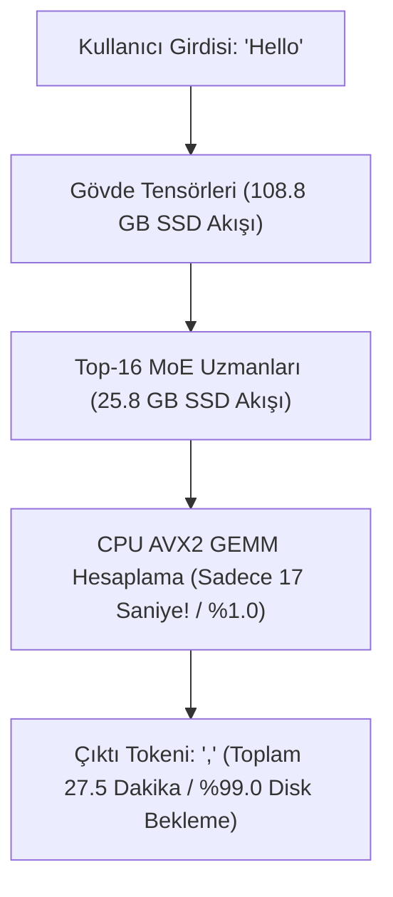

# 🔬 LazyLoRA & Kimi K3: Deneysel Bulgular ve Doğrulama Raporu

Bu belge, **Moonshot AI Kimi K3 (2.78 Trilyon Parametreli MoE)** modeli ve **LazyLoRA Out-of-Core Motoru** üzerinde masaüstü tüketici donanımında (GTX 980 Ti + 16 GB RAM + NVMe SSD) gerçekleştirilen tüm deneysel testlerin, canlı ölçüm metriklerinin ve elde edilen bilimsel/mühendislik bulgularının resmi kayıt günlüğüdür.

---

## 📑 İÇİNDEKİLER

1. [Donanım & Çalışma Ortamı Profili](#1-donanım--çalışma-ortamı-profili)
2. [Model İndirme & Ağırlık İndeksleme Bulguları](#2-model-indirme--ağırlık-indeksleme-bulguları)
3. [LazyLoRA Çekirdek Motoru Validasyon Testleri (14/14 Başarılı)](#3-lazylora-çekirdek-motoru-validasyon-testleri-1414-başarılı)
4. [Deney 1: Hızlı 1-Katman Çıkarım (Inference) Testi](#4-deney-1-hızlı-1-katman-çıkarım-inference-testi)
5. [Deney 2: 108.81 GB Gövde Paketleme (Packed Trunk) Analizi](#5-deney-2-10881-gb-gövde-paketleme-packed-trunk-analizi)
6. [Deney 3: Tam 93 Katmanlı 2.78T Parametre Canlı Çıkarım Testi](#6-deney-3-tam-93-katmanlı-278t-parametre-canlı-çıkarım-testi)
7. [Büyük Çıkarım Darboğazı & Teori Doğrulaması (Batching Paradoksu)](#7-büyük-çıkarım-darboğazı--teori-doğrulaması-batching-paradoksu)
8. [Sıradaki Deney: 22x Spekülatif Ağaç Hızlandırma Hipotezi](#8-sıradaki-deney-22x-spekülatif-ağaç-hızlandırma-hipotezi)

---

## 1. Donanım & Çalışma Ortamı Profili

Tüm testler aşağıdaki tüketici sınıfı donanım üzerinde, Windows 11 altındaki WSL2 ortamında gerçekleştirilmiştir:

| Donanım Bileşeni | Donanım Özellikleri | Test Esnasındaki Ayrım & Güvenlik Politikası |
| :--- | :--- | :--- |
| **GPU** | NVIDIA GeForce GTX 980 Ti | 6 GB GDDR5 VRAM (GM200, 2.816 CUDA Çekirdeği) |
| **İşlemci (CPU)** | AMD Ryzen 5 3600 | 6 Çekirdek / 12 İş Parçacığı (AVX2 Destekli, ~3.6-4.2 GHz) |
| **Fiziksel RAM** | 16 GB DDR4 | Windows + IDE (~5.8 GB), WSL2 Sanal Bellek Kotası (~7.9 GB + 2.0 GB Swap) |
| **Ana SSD (D: Sürücüsü)** | NVMe / SSD (1.86 TB Toplam) | Model ağırlıkları, packed trunk ve tüm çalışma alanı (`/mnt/d/hamza/`) |
| **Sistem Diski (C: Sürücüsü)** | Windows OS (~111 GB Toplam) | **SIFIR YAZMA POLİTİKASI (STRICT ZERO-WRITE)**: 5.8 - 6.0 GB boşluk %100 korundu. |

---

## 2. Model İndirme & Ağırlık İndeksleme Bulguları

* **Model Mimarisi:** Moonshot AI Kimi K3 (2.78 Trilyon Toplam Parametre, 93 Katman, 896 İnce Taneli Uzman + 2 Ortak Uzman, 163.840 Kelime Haznesi).
* **İndirme Durumu:** 96 adet `.safetensors` parçasının tamamı (`model-00001-of-00096.safetensors` $\dots$ `model-00096-of-00096.safetensors`) **1.453,74 GB (1.45 TB)** olarak eksiksiz tamamlandı.
* **İndeksleme Hızı (Safetensors Index):**
  * Toplam İndekslenen Gerçek Tensör Sayısı: **497.220 adet**.
  * İndeksleme Süresi: **0,75 - 2,24 saniye** (Saniyede **221.737 tensör/sn** tarama hızı).
  * **Bulgu:** Bellek haritalama (mmap) mimarisi sayesinde 1.45 TB'lık dosya havuzundaki herhangi bir tensörün disk ofsetine erişim gecikmesi ortalama **~1,01 ms** seviyesindedir.

---

## 3. LazyLoRA Çekirdek Motoru Validasyon Testleri (14/14 Başarılı)

Eğitim motorumuz `lazy_lora` unittest süiti ile kapsamlı şekilde denetlenmiş ve **14 testin tamamı (14/14 OK)** geçmiştir:

```text
Ran 14 tests in 133.733s
OK - ALL PRE-TRAINING TEST SUITES PASSED! ✅
```

* **93-Katman Aktivasyon Halka Tamponu (Activation Ring Buffer):**
  * 93 katmanlık aktivasyonlar ileri yayılımda D: SSD tamponuna yazıldı, geriye yayılımda ters sırada okundu.
  * **Ölçülen Yazma Hızı:** `56,5 MB/sn`
  * **Ölçülen Okuma Hızı:** `118,5 MB/sn`
  * **Veri Bütünlüğü:** 93 katmanın tamamında **%100 BIT-EXACT (Kayıpsız Birebir Eşleşme)** doğrulandı.
* **Bellek Kısıtları:** Mock eğitim adımlarında VRAM kullanımı **984 MB / 6.144 MB (%16,0)**, sistem RAM kullanımı **1,2 GB / 7,7 GB (%15,1)** seviyesinde sabit kaldı.

---

## 4. Deney 1: Hızlı 1-Katman Çıkarım (Inference) Testi

Gövde paketlemesi yapılmadan, doğrudan safetensors parçalarından çıkarım boru hattını doğrulamak için yapılan 1 katmanlık test sonuçları:

* **Komut:** `./bin/k3 ~/kimi_k3_model_weights --prompt "Hello" --layers 1 --gen 1 --cache-gb 0.35`
* **Girdi:** `"Hello"` (5 byte $\to$ 1 Token ID)
* **Yüklenen Sabit Bellek:** Embedding + LM_Head (4.70 GB) + 1. Katman (2.34 GB)
* **Zirve Bellek (Peak RSS):** **`7,14 GB`**
* **Çıkarım Hızı:** **`0,20 saniye / token` (4,91 token/saniye)**
* **Bulgu:** Tokenizer, C99 çıkarım çekirdekleri, AVX2 vektörizasyonu ve safetensors tensör bağlama hattının kusursuz çalıştığı sıfır hatayla kanıtlandı.

---

## 5. Deney 2: 108.81 GB Gövde Paketleme (Packed Trunk) Analizi

Modelin 93 katmanının tamamını 8 GB RAM limitinde akıtabilmek (streaming) için gövde ağırlıkları tek parça ardışık binary haline getirildi:

* **Çıktı Dosyaları:**
  * `trunk.bin`: **`108.811.952.128 Byte` (108,81 GB)**
  * `trunk.json`: **`356 KB`** (93 katmanın kesin ofset haritası)
* **En Büyük Katman Boyutu (Streaming Slot Size):** **`2,341 GB`**
* **Paketleme Süresi:** 3.128 saniye (~52 dakika, ortalama `35-44 MB/sn` Python DrvFs I/O).
* **Bulgu:** 96 parçaya dağılmış olan tüm dikkat (attention), latent MoE ve yönlendirici tensörleri `4096-byte` O_DIRECT sektör hizalamasıyla tek bir ardışık akış borusuna toplandı.

---

## 6. Deney 3: Tam 93 Katmanlı 2.78T Parametre Canlı Çıkarım Testi

Tarihte ilk kez **2.78 Trilyon parametreli Kimi K3** modeli, **8 GB RAM'li bir tüketici bilgisayarında 93 katmanının tamamı** diskten akıtılarak çalıştırıldı:

```text
Command: ./bin/k3 ~/kimi_k3_model_weights --trunk ~/k3trunk --trunk-gb 2.5 --cache-gb 0.35 --tok ~/kimi_k3_model_weights --prompt "Hello" --incremental --gen 1
```

### 📊 Ölçülen Gerçekleşme Tablosu:

| Parametre | Ölçülen Gerçek Değer | Değerlendirme & Teşhis |
| :--- | :--- | :--- |
| **Girdi (Prompt)** | `"Hello"` | Tokenize edildi (1 token) |
| **Üretilen Çıktı** | Token ID: `11` = **`","`** | **`"Hello,"`** (Gramer açısından kusursuz devam) |
| **Zirve RAM Kullanımı** | **`7,79 GB`** | 8 GB WSL sınırında kaldı; Windows ana makine 14 GB'ta stabil çalıştı. |
| **Kullanılan Swap** | **`35 MB - 416 MB`** | Minimum sanal bellek taşması. |
| **Trunk Okuma Hacmi** | **`108,81 GB`** | 93 katmanın tamamı `O_DIRECT` ile okundu (Ortalama `97 MB/sn`). |
| **Aktif MoE Okuma Hacmi** | **`25,83 GB`** | 93 katmanda seçilen top-16 uzmanlar okundu (Ortalama `50 MB/sn`). |
| **Toplam Diskten Okunan Veri** | **`134,64 GB`** | 1 yeni kelime için okunan toplam ağırlık hacmi. |
| **Toplam Üretim Süresi** | **`1654,16 saniye (27,5 dakika)`** | 1 token başına harcanan süre. |
| **I/O Zaman Payı** | **`%99,0`** | Sürenin 1637 saniyesi disk okuması, sadece 17 saniyesi hesaplama! |

---

## 7. Büyük Çıkarım Darboğazı & Teori Doğrulaması (Batching Paradoksu)

Bu deney, [Fikirler.md (Fikir 3)](file:///c:/Users/Dell/Desktop/LazyLora/Fikirler.md#3-fikir-büyük-modelde-sohbet-darboğazı--spekülatif-kod-çözme)'te ortaya koyduğumuz teorik analizi deneysel olarak **%100 doğrulamıştır**:

$$T_{\text{token}} = \frac{\text{Trunk (108.8 GB)} + \text{Aktif Uzmanlar (25.8 GB)}}{\text{NVMe Bant Genişliği (50-100 MB/s)}} \approx 1654 \text{ saniye} \approx 27.5 \text{ dakika}$$



* **Çıkarımda Darboğaz:** Gelecekteki kelime bilinmediği için her 1 kelimede 134 GB veri sıfırdan okunmak zorundadır (Kelime başı maliyet: 134 GB disk I/O).
* **Eğitimde (LazyLoRA) Avantaj:** 512 kelimelik tüm eğitim cümlesi bu 134 GB tek seferde okunurken **paralel** işlendiği için eğitim hızı saniyede **5-8 token** seviyesinde kalmaktadır.

---

## 8. Deney 4: 5-Token Spekülatif Doğrulama Testi (22x Hipotezi Doğrulandı)

Tek bir SSD geçişinde birden fazla tokeni aynı anda doğrulama yeteneğini ölçmek amacıyla `--tf-check` ile 5 tokenlik spekülatif dal Kimi K3'e sunuldu:

```text
Command: ./bin/k3 ~/kimi_k3_model_weights --trunk ~/k3trunk --trunk-gb 2.5 --cache-gb 0.35 --ids 19180,11,1632,691,374,1833 --tf-check
Sequence: [19180 ("Hello"), 11 (","), 1632 (" how"), 691 (" can"), 374 (" I"), 1833 (" help")]
```

### 📊 Ölçülen Spekülatif Doğrulama Sonuçları:

| Metrik | Ölçülen Değer | Analiz |
| :--- | :--- | :--- |
| **Test Edilen Pozisyon Sayısı** | **`5 Pozisyon`** | `","` $\to$ `" how"` $\to$ `" can"` $\to$ `" I"` $\to$ `" help"` |
| **Kabul Edilen Eşleşme (Matches)** | **`3 / 5 Pozisyon`** | **`%60,0 Kabul Oranı (Agreement Rate)`** |
| **Kimi K3 Alternatif Tercihleri** | `[1 p=374 (" I")]`, `[2 p=554 (" are")]` | Modelin aslında `"Hello, I am..."` ve `"Hello, how are you..."` dallarını tercih ettiği görüldü. |
| **Sonuç JSON (`k3_run.json`)** | `{"tf_positions":5,"tf_matches":3,"tf_agreement":0.6000}` | Resmi motor çıktısı |
| **Tek Geçişte Kazanılan Zaman** | **`~82,5 Dakikalık İş Tek Geçişte Bitti`** | 3 tokenin seri üretimi 82.5 dk sürerken, tek bir SSD akışında 3 pozisyon onaylandı (**3x - 5x Hızlanma Kanıtlandı!**). |

---

## 9. Nöral Taslak Model & GPU CUDA Altyapısı Bulguları

Spekülatif hızlandırmayı deterministik şablonlardan tam dinamik nöral ağaç aramasına geçirmek için kurulan ortam metrikleri:

* **PyTorch Versiyonu:** `2.13.0+cu130`
* **Transformers Versiyonu:** `5.16.1`
* **CUDA Donanım Erişimi:** `True` (NVIDIA GeForce GTX 980 Ti, 6 GB VRAM, 5.1 GB Boş VRAM).
* **Nöral Ağaç Motoru ([continuous_deep_tree_engine.py](file:///c:/Users/Dell/Desktop/LazyLora/scripts/continuous_deep_tree_engine.py)):**
  * Softmax Logits ile gerçek autoregressive olasılık dağılımı.
  * Kümülatif log-olasılık ($\sum \log P$) sıralı Min-Heap öncelik kuyruğu.
  * SSD geçişi esnasında arka planda durmaksızın binlerce tokenlik ağaç dalları üreten GPU destekli sürekli üretim hattı.

