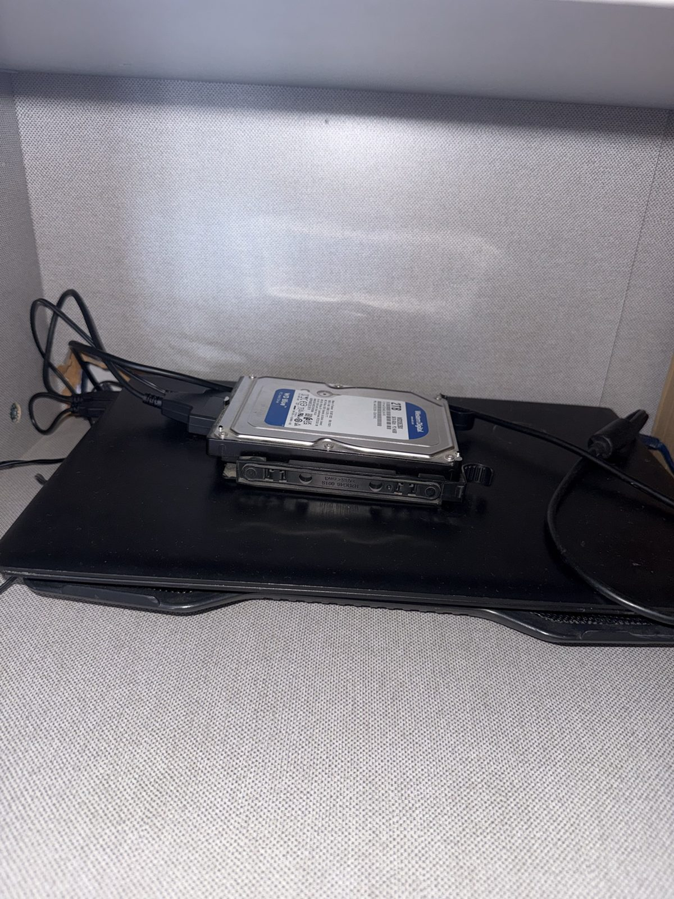
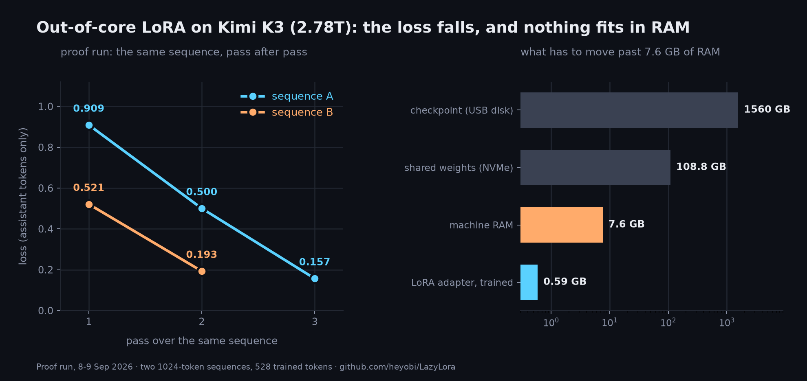

# LazyLoRA

[](https://github.com/heyobi/LazyLora/actions/workflows/quickstart.yml)

**TL;DR.** A LoRA adapter is being trained on Kimi K3, a 2.78 T Mixture-of-Experts model, on a
2017 laptop with 7.6 GB of RAM, with the 1.56 TB checkpoint streamed from a USB hard disk one
layer at a time. The forward pass matches an independent C implementation on all 93 layers
(cosine 0.9857 or better; the log is in [`evidence/`](evidence/)), the gradients pass
finite-difference checks, and the engine runs end to end on GitHub's runners on every push
with no model. A step takes about 7.4 h; the 100-step run ends 9-11 October 2026 and is scored
against a threshold committed before it started. Five expert-routing traces are in the
repository, and the finding worth reading first is that expert locality holds per token but
collapses across a training batch. Sceptical: start with [FAQ.md](FAQ.md). Want to run it:
[docs/QUICKSTART.md](docs/QUICKSTART.md).

Out-of-core LoRA fine-tuning and routing measurement for **Kimi K3** — 2.78 trillion
parameters, 93 layers, 896 routed experts per layer, MXFP4 expert weights — on one 2017
laptop: an i7-7700HQ, 7.6 GB of RAM, a 2 GB GTX 1050, and the 1.56 TB checkpoint on a hard
disk in a USB enclosure.

**The claim, stated exactly as strong as the evidence.** A LoRA adapter has been trained on
Kimi K3 out of core on this machine. The base model is frozen and never enters memory whole:
layers stream from disk one at a time, and the only thing trained is a 590 MB adapter. The
forward pass is checked layer by layer against an independent C implementation over all 93
layers. The gradients are checked against central finite differences on real weights. On a
five-example proof run the loss on a fixed sequence fell 0.909 → 0.500 → 0.157 over three
passes, which is memorisation of five examples and demonstrates that the loop is correct.
The raw output of those checks is **in this repository**, in [`evidence/`](evidence/): the
93-row comparison log, all five routing traces, and the per-step losses with their
timestamps. [How you know this is real](#how-you-know-this-is-real) says, check by check,
which file to open and what is still not checkable without the 1.56 TB checkpoint.

**What is not claimed.** Kimi K3 was not trained from scratch; 2.78 trillion parameters were
frozen throughout. The model has not been shown to have got better at anything. **No
evaluation result exists yet.** The main run is in progress; the success threshold was
committed to git before it started, and a negative result will be published as a negative
result.

**How this was built.** This repository was written with heavy AI assistance — Claude Code,
on this machine, through most of its life; the `Co-Authored-By: Claude` trailer starts at the
twenty-ninth commit and is on every commit from there on — count it on the day you read
this with `git log --format='%(trailers:key=Co-Authored-By,valueonly)' | grep -c Claude`
against `git log --oneline | wc -l` — so the
trailer is not a complete record of where the assistance was used,
and what was not delegated is the hardware, the 1.56 TB checkpoint, every run whose timestamps
are in [`evidence/`](evidence/), and the judgement, check by check, of what this work is
allowed to claim — which is the reason [How you know this is real](#how-you-know-this-is-real)
is the longest section in this file.



*The machine. The 1.56 TB checkpoint lives on that disk; the USB bridge under it resets forty to fifty times an hour under this load and the engine retries each read, which is why the run has not stopped. Photograph taken on 10 September 2026, step 3 of the main run in progress.*



*Step 1 of the main run, and nothing else: 93 layers forward in 3 h 11 m 34 s, the forward
loss 0.9091, 93 layers backward in 3 h 48 m 07 s, 6 h 59 m 41 s in total. Three timestamps
are measured — the start (`evidence/run_manifest.json`), the forward loss
([`evidence/forward_loss_main.jsonl`](evidence/forward_loss_main.jsonl)) and the end of the
backward (the run log) — and the per-layer lines between them are interpolated at the
measured pace of 123.6 and 147.2 s per layer; the caption inside the image says that the
layer times are interpolated. There is no checkpoint line because this run saves every
fifth step. Rendered by
`scripts/make_terminal_svg.py`.*

*Türkçe okuyucu için:* proje günlüğü [DEVAM.md](DEVAM.md), deney kayıtları
[Bulgular.md](Bulgular.md), fikir havuzu [Fikirler.md](Fikirler.md), kanıt koşusunun Türkçe
anlatımı [kanıt koşusu sayfası](https://heyobi.github.io/LazyLora/kanit_kosusu.html)
(kaynağı [docs/kanit_kosusu.html](docs/kanit_kosusu.html), GitHub Pages ile bu depodan
servis ediliyor).

---

## The proof run



Proof run, 8–9 September 2026. Five Turkish instruction examples were packed into two
sequences, **1082 tokens in total, 528 of them trained answer tokens** (the packing limit is
1024; neither sequence reaches it). The two sequences alternate, so B's first measurement is
taken after the first update on A. Loss is computed on answer tokens only; prompt tokens are
masked. lr 1e-3, warmup 2.

| step | sequence | loss | perplexity | forward finished |
|---:|---|---:|---:|---|
| 1 | A | 0.909 | 2.48 | 8 Sep 12:26 |
| 2 | B | 0.521 | 1.68 | 8 Sep 18:13 |
| 3 | A | 0.500 | 1.65 | 8 Sep 23:42 |
| 4 | B | 0.193 | 1.21 | 9 Sep 05:28 |
| 5 | A | 0.157 | 1.17 | 9 Sep 11:03 |

Each timestamp is when that step's **forward pass** ended; the step's backward runs about
three hours longer, so consecutive rows are 5.5–5.8 hours apart (mean 5.65 h over the four
measured intervals). Every row of that table is a line of
[`evidence/forward_loss_proof.jsonl`](evidence/forward_loss_proof.jsonl), losses and Unix
timestamps as the trainer wrote them. Those are the step times of **this** run, on
sequences of about 541 tokens each; the main run's full 1024-token step is longer,
step 1 measured 6 h 59 m 41 s on its own, and the run's measured cadence over its first three steps is about 7.4 h (intervals 7.26 h and 7.62 h). Those two intervals are **not** derivable from the bundle: [`evidence/forward_loss_main.jsonl`](evidence/forward_loss_main.jsonl) is a snapshot that stops at step 1, so the cadence is read from the live trainer log on this machine and is the author's word until the snapshot is re-cut. At that pace 100 steps is about 31 days, finishing around 9-11 October 2026. The proof run's pace must not be quoted for either. The process held a
resident set of 4.5–4.7 GB for 27 hours on a 7.6 GB machine. The USB bridge reset roughly
45 times an hour under load; no read failed permanently. The run was stopped after five
steps because the remaining steps would have added nothing. Details:
[Bulgular.md](Bulgular.md) §18.

**What this proves and what it does not.** It proves that forward → backward → AdamW →
checkpoint is correct end to end on this machine, that the loss can be driven down, and that
the adapter of a 2.78 T-parameter model can be moved by gradient descent inside 7.6 GB of
RAM. It does not prove generalisation. Falling loss on five examples is memorisation, and
memorisation is exactly what this experiment was designed to produce. Whether the model is
actually better at Turkish is tested after the main run, against a threshold registered
before training started.

---

## How you know this is real

Four independent checks, and — since `evidence/` went into the repository — the raw output
of most of them.

The questions a sceptic asks first, with the file to open for each, are in [FAQ.md](FAQ.md);
every number quoted anywhere in this project, with its source, is in
[docs/numbers.md](docs/numbers.md); what was checked before this repository went public, and
what the checking found wrong, is in [docs/pre_publication_check.md](docs/pre_publication_check.md).

Where this document and [docs/numbers.md](docs/numbers.md) disagree, that table names the source and the source settles it.

| Check | Result | Scope, stated precisely |
|---|---|---|
| **Forward vs an independent implementation** | every one of the 93 layers at cosine **≥ 0.9857**, and **0.999840** at the output | 34 tokens of one English paragraph, with an untrained adapter (LoRA B is zero-initialised, so both engines must agree exactly). **The full log is in the repository: [`evidence/cmp93_en34_2026-09-06.log`](evidence/cmp93_en34_2026-09-06.log)** — 98 lines, one row per layer, each with the cosine, the maximum absolute difference, both implementations' standard deviations and the number of experts that layer read; 2869 s and 426.59 GB of reads at the bottom. The dip runs from layer 68 to layer 72 (0.989709, 0.987459, 0.986975, **0.985744**, 0.987909), with the three lowest rows of the whole file at 69–71. Earlier drafts of this README said "minimum 0.988 at layer 72": that was the lowest of the nine layers spot-checked in [Bulgular.md](Bulgular.md) §17.1, not the lowest of the 93, and the log is what settles it. Not verified with a trained adapter, at 1024-token lengths, or on Turkish or code input. |
| **Op-level fixtures** | 7 of 8 match at **1e-5 absolute / 1e-4 relative**; the MoE block matches at **2e-4 absolute** (cosine 1.000000) | `rmsnorm`, `situ_glu`, `shortconv`, `kda_decay`, `router`, `attnres`, `mla` at 1e-5; `moe` needed the wider tolerance, which is the MXFP4 decode path's own rounding. `lazy_lora/tests/test_reference_ops.py` hardcodes `abs_tol=2e-4` for that one fixture ([Bulgular.md](Bulgular.md) §15.6; commit `588ec07`, "Widen the MoE fixture tolerance, and record the reference validation in Bulgular.md"). The MoE block does **not** match at 1e-5. |
| **Gradients vs central finite differences** | worst relative error **9.1e-3**, at layer 1, in two directions whose analytic derivative is about 3e-4 — at that magnitude the finite difference is the noisier estimate; **3.6e-3** on the MLA layer; the rest at or under **2.0e-3** | Four representative layers of 93 — 1 (KDA + MoE, one bank entry), 3 (MLA), 12 (block boundary), 13 (two bank entries) — on 4 tokens, in an fp32 engine with float64 loss reduction, adaptive epsilon and routing-flip detection. Layers 1 and 3 were checked over all 16 LoRA tensors of the layer plus the input and residual-bank directions (worst 9.1e-3 and 3.6e-3 respectively); layers 12 and 13 over the input and bank directions and the layer's LoRA tensors as recorded in [DEVAM.md](DEVAM.md) §11 (2.0e-3 and 9.1e-4). This is not a whole-model gradient check. The end-to-end evidence that the loop is correct is the proof run's falling loss. |
| **Refusal to fabricate** | a tensor missing on disk raises `MissingTensorError` | Synthetic stand-in tensors exist only for the mock suite and only behind `LAZYLORA_ALLOW_SYNTHETIC=1` (`lazy_lora/core/config.py`). Nothing in a real run silently substitutes random weights. An earlier version of this engine generated the router gates at random instead of reading them from disk and produced plausible-looking losses for days ([Bulgular.md](Bulgular.md) §11.3); the gate exists so that cannot happen again. |

### The evidence bundle

[`evidence/`](evidence/) is 6.2 MB of the files those checks and the routing section were
computed from. `SHA256SUMS` covers all 25 of them (`sha256sum -c SHA256SUMS` from inside the
directory), and [`evidence/README.md`](evidence/README.md) describes each one.

| | |
|---|---|
| `cmp93_en34_2026-09-06.log` | the 93-row forward comparison against `kimi-k3-in-c`, above |
| `traces/` — five directories, 6.1 MB | the expert-routing traces of all five texts over all 92 MoE layers: `trace.bin` (layer, token, the 16 chosen experts and their combining weights), `trace.json` (text, token ids, per-layer timings and byte counts), `analysis.json` and `analysis.md`. **Every number in [Measurement findings](#measurement-findings) is recomputable from these** — with `scripts/analyze_trace.py`, or with numpy and twenty lines of `struct` unpacking, which `evidence/README.md` prints. No checkpoint, no GPU, no special hardware. (Run without `--prefix` it rewrites `analysis.json` in the trace directory — that is how the committed copies were made — so copy the directory first, or use `--prefix N`, which only prints, if you want `sha256sum -c SHA256SUMS` to keep passing.) |
| `forward_loss_main.jsonl`, `forward_loss_proof.jsonl` | one line per completed forward pass: step, loss, perplexity, Unix timestamp. The proof run's step-to-step intervals and the main run's forward are genuine subtractions of two of these; the main run's backward (3 h 48 m 07 s) and its 6 h 59 m 41 s total are **not** in the bundle and come from the trainer's own printed timings, because a line is written when the forward ends and nothing here marks the end of a backward. The two files are two snapshots of one rolling log rather than one file per run — the main file is the proof file with the main run's step 1 appended — so earlier smoke-test rows (a `nan`, a series at loss ≈ 12.0 on random weights) sit above the run itself. |
| `run_manifest.json` | the live run's manifest — data file, steps, hyper-parameters, start time |

Nothing there was regenerated, rounded or reconstructed for publication; the only edit is
that this machine's own paths were replaced with placeholders. The five traced texts were
written for this study, the Turkish news-style paragraph (about hazelnut production
statistics) included — it is not taken from Anadolu Agency, the BBC or any other
publication.

**What is still not checkable from this repository.** The 1.56 TB checkpoint, the C engine's
per-layer dump, the 108.8 GB NVMe trunk and the 1.8 GB training checkpoints are not here and
cannot be. The finite-difference harness prints its table to the terminal rather than to a
file, so those numbers are quoted from [DEVAM.md](DEVAM.md) §11 and reproducing them means
re-running `scripts/verify_backward.py` on the real weights. The quickstart a reader would
run — the op fixtures, the engine end to end on a generated checkpoint, the
finite-difference check on it — was in that same position until 10 September 2026, when it
first executed on a GitHub Actions runner; it now runs on every push, and the badge above,
not this paragraph, is the current claim.

---

## Quickstart, without the 1.56 TB checkpoint

> **This quickstart was written without being run, and the first machine to run it was not
> mine.** It was written by reading the engine while the machine that could execute it was
> occupied by the 31-day training job, so its first execution anywhere was on a GitHub
> Actions runner. Five of its seven steps passed on that first attempt; the sixth was
> skipped for want of fixtures that are now committed, and the seventh failed — on a
> gradient that turned out to be correct, with a finite-difference step too small for fp32
> to resolve against a tensor of norm 60.8. That is written up in `Bulgular.md` §20, the
> step rule is fixed, and the check now agrees to 2.09e-05 instead of failing at 3.1e-02.
> The workflow in `.github/workflows/quickstart.yml` runs the whole thing on every push, so
> the badge, not this paragraph, is the current claim. Timings in this section are still
> derived from the code rather than measured on my hardware.

```bash
git clone https://github.com/heyobi/LazyLora && cd LazyLora
python3 -m venv .venv && . .venv/bin/activate
pip install -r requirements.txt         # numpy and torch>=2.3; the engine imports nothing else
# pip install -e .                      # the same two packages, plus lazy_lora on the path
bash scripts/quickstart.sh              # the full suite
# bash scripts/quickstart.sh --fast     # skips the synthetic-weight suite
```

`torch>=2.3` is a hard floor, not a preference: every bf16 weight read reinterprets a
numpy `uint16` array with `torch.from_numpy(...).view(torch.bfloat16)`
(`lazy_lora/streaming/mmap_loader.py:326`), and torch gained `uint16` support in
`from_numpy` in 2.3. On 2.2 the first streamed tensor raises `TypeError`.

`scripts/quickstart.sh` writes everything into one `mktemp -d` sandbox that it deletes on
exit (`--keep`, or `--dir PATH`, keeps it); it writes nowhere else, and in particular it
writes nothing into the clone. Derived from the code paths, it should take about two
minutes with `--fast` and three to four with the full suite, at a peak resident set of
about 600 MB — except during the synthetic-weight suite, which holds a further ~330 MB.
Step by step, in the order the script runs them, and documented in
[docs/QUICKSTART.md](docs/QUICKSTART.md):

| | What it runs | What it shows |
|---|---|---|
| 0 | exports the `LAZYLORA_*` paths into a `mktemp -d` sandbox | nothing is written outside that directory, and it is deleted on exit |
| 1 | `python -m unittest lazy_lora.tests.test_reference_ops` | the 8 op fixtures against the independent C implementation, from the copies vendored at [`tests/fixtures/ops/`](tests/fixtures/ops/) — so this step passes on a plain clone and no longer reports `SKIP`, which is what it did on the first CI run, before the fixtures were committed on 10 September 2026. The module still skips rather than fails when it can find no fixtures at all, so read the result for `OK` and not `skipped`; `LAZYLORA_REF_FIXTURES` overrides the vendored copies with your own `kimi-k3-in-c` clone. |
| 2 | `scripts/make_tiny_model.py` | generates a **real** Kimi-K3-shaped checkpoint from a fixed seed — 4 layers, hidden 256, 8 experts, MXFP4-packed, about 250 tensors and roughly 8.3 MB across two safetensors shards (the script prints the exact byte count) |
| 3 | `scripts/check_shards.py` | the same integrity checker that guards the real run, against a real index |
| 4 | a real forward pass through the real engine | streamed weights, KDA and MLA attention, the residual bank, the router and the MXFP4 experts, with the loss sitting at the uniform prior ln(2048) ≈ 7.6, which is where an untrained model belongs |
| 5 | `bash scripts/run_mock_tests.sh` (skipped by `--fast`) | ring buffer, router, LoRA gradients, checkpoint round-trip, dataset streaming |
| 6 | ten training steps on one fixed sequence | the whole out-of-core loop — streamed layers, activation ring buffer, autograd replay, MXFP4 experts, AdamW, atomic checkpoint, reload |
| 7 | an inline finite-difference check on layer 3, the same method as `scripts/verify_backward.py` | the gradient check in seconds instead of hours. It is a re-implementation, not a call: `verify_backward.py` builds its config from `get_default_config()`, which has no hook for a checkpoint's own `config.json`, so that script only runs against the real 93-layer weights. |
| extra | the same forward pass re-run with `LAZYLORA_NO_NATIVE=1` | the hand-written AVX2/OpenMP MXFP4 kernel and the reference torch decoder agree |

The point of the generated checkpoint is that **`LAZYLORA_ALLOW_SYNTHETIC` stays unset**.
These are real weights read from real bytes on disk, just small ones; the forward and the
backward read the same bytes, so the loss curve and the gradient check mean something. What
the quickstart does **not** show is anything about Kimi K3 itself: it is the same code path
and the same verification harness on a toy model.

Linux or macOS. The hot read path uses `os.pread`, so Windows is not supported. The native
MXFP4 kernel needs gcc with OpenMP and AVX2; where it is unavailable the engine falls back to
a torch decode path that is slower and numerically equivalent.

---

## The engine

Kimi K3 has 93 layers — 69 KDA linear-attention layers and 24 gated MLA layers — with
896 routed experts and 2 shared experts in each of the 92 MoE layers, top-16 routing, MXFP4
expert weights at 17.5 MB per expert, and a residual bank that restarts the stream every 12
layers. None of it fits anywhere on this machine, so nothing is ever fully resident.

**Streaming.** Shards are read with `pread` through a hand-written safetensors header parser
(`safetensors` is not a dependency; the reader indexes 96 shards itself and serves byte
ranges). The forward pass keeps exactly one layer's weights in memory and drops them at the
layer boundary. Non-expert weights — attention projections, norms, router gates, the latent
MoE projections — are packed once into a contiguous 108.8 GB **trunk** file on NVMe and
served through an index overlay, so the USB disk is left to do only what it must: stream
routed experts.

**Activations.** Layer-boundary hidden states go to a disk-backed **ring buffer** on NVMe
rather than staying in RAM. The backward pass reads the boundary state back, re-runs the
layer under `enable_grad`, and takes the gradients — gradient checkpointing with the store
moved from memory to disk, at a depth of 93.

**Routed experts.** Keeping 16 experts per token in an autograd graph across 92 MoE layers
would cost tens of gigabytes, so the routed experts are a single `torch.autograd.Function`.
The experts stream from disk once in the forward and a second time in the backward; the LoRA
gradients and `dL/dh_latent` are computed explicitly inside it.

**Residual bank.** Kimi K3 pushes the residual stream onto a bank every 12 layers and mixes
it back with a learned softmax. Bank entries are the boundary layers' inputs and already sit
in the ring buffer, so the backward reconstructs the bank from there; gradient flowing into
the bank is held until the sweep reaches that boundary layer, then added to the input
gradient.

**Arithmetic.** A native C kernel (`native/mxfp4_gemm.c`, OpenMP + AVX2) fuses MXFP4
decode with the dot product, so quantised experts are consumed packed instead of being
widened first. Frozen-weight matmuls run through an fp32 path: on this CPU a bf16 GEMM has no
fast path and falls back to a reference implementation, which cost about 13 minutes per layer
in the attention projections. Weights stay bf16 in memory and are widened per product, so the
numerics are unchanged. Expert sums accumulate in fp32, as the C reference does; bf16
accumulation shifted a layer's output by ~1e-3 and changed routing a few layers later.

### File map

```
lazy_lora/
  core/config.py            paths, architecture/LoRA/training config, the synthetic-tensor gate
  core/attention.py         KDA (chunked, checkpointed recurrence) and gated MLA; block-residual mixer
  core/moe_router.py        top-16 gating with the score-correction bias
  core/situ_activation.py   SiTU: 4·tanh(g/4)·σ(g) × 25·tanh(u/25)
  core/linear32.py          frozen-weight matmuls in fp32 (see "Arithmetic" above)
  core/lora_layer.py        LoRA A/B in fp32 with analytic gradients
  native/mxfp4_gemm.c       fused MXFP4 decode-and-dot, transposed product, fast decoder
  streaming/mmap_loader.py  pread shard reader, own header parser, NVMe trunk overlay
  streaming/trunk_streamer.py       per-layer dense weights
  streaming/expert_streamer.py      packed-expert streamer (MXFP4 in, packed out)
  streaming/activation_ring_buffer.py   disk-backed layer-boundary activations
  trainer/lazy_trainer.py   one differentiable layer function shared by forward and backward;
                            routed experts as a single autograd.Function; bank gradient routing;
                            optional CUDA expert path; atomic checkpoints with --resume
  trainer/optimizer.py      AdamW over the LoRA tensors only, with clipping and a cosine schedule
  dataset/stream_dataset.py sample packing and prompt masking
  monitor/trace.py          expert access trace format (layer, token, expert, weight) and reader
  tests/                    the mock suite plus the op fixtures against the C reference

scripts/
  check_shards.py           offline checkpoint integrity (catches empty and truncated shards)
  compare_with_c_dump.py    replay the C engine's per-layer dump and compare
  verify_backward.py        central finite differences against the analytic backward, fp32;
                            builds its config from get_default_config(), so it runs against
                            the real 93-layer checkpoint only
  quickstart.sh, make_tiny_model.py   the no-checkpoint demo and the tiny generated
                            checkpoint it runs on — written by reading the engine and first
                            executed on a GitHub runner on 10 September 2026; it runs on
                            every push now, but never on the author's hardware, so the
                            timings in docs/QUICKSTART.md are still derived from the code
  demo_generate.py          the same prompts answered with the adapter off and on, side by
                            side. There is no KV cache: every token is a full 93-layer sweep,
                            which the script estimates at about five minutes per token here,
                            so a 50-token answer would be a four-hour job. That estimate is
                            read off the code, not timed. Never executed on this machine —
                            the machine has been busy with the training run since 9
                            September — and exercised on a GitHub runner by
                            .github/workflows/tools.yml, on the tiny generated checkpoint
                            and not on Kimi K3
  export_traces.py          validates, strips text from, checksums and manifests trace
                            directories for release. Never executed on this machine: the
                            traces in evidence/ were copied out without it, texts included.
                            .github/workflows/tools.yml exercises it on a GitHub runner
  make_terminal_svg.py      the animated terminal figure at the top, from the run logs
  measure_routing.py, analyze_trace.py      routing traces and their statistics
  build_train_set.py        Dolly-15k-tr selection (400 examples), packing, prompt masking
  build_eval_corpus.py, build_eval_news.py, eval_perplexity.py   the evaluation protocol
  plot_proof.py             the proof-run figures, from the loss log
  train_lazy_lora.sh        training entry point (refuses to start on an incomplete checkpoint)
  watchdog.py + systemd/    unattended runs: progress, health, auto-resume, USB reconnect
  status.sh, status.py      one-screen status
  build_speculative_tree.py, continuous_deep_tree_engine.py, patch_k3.py   earlier
                            directions (speculative decoding, the C-engine memory patch),
                            kept for the record; nothing in the engine or the tests calls
                            them. What each one was and why it is out: docs/attic/README.md

evidence/                   6.2 MB of raw output, SHA256SUMS over all 25 files
  cmp93_en34_2026-09-06.log   98 lines: the 93-layer forward comparison against the C engine
  traces/*_L93_2026-09-06/    the five routing traces (trace.bin, trace.json, analysis.json,
                              analysis.md), 92 MoE layers each, 6.1 MB together
  forward_loss_main.jsonl, forward_loss_proof.jsonl   per-step loss with Unix timestamps
  run_manifest.json           the live run's manifest, local paths replaced by placeholders
```

LoRA: rank 16, alpha 32, dropout 0, on `q_proj`, `v_proj` and the expert `gate_proj`,
`up_proj`, `down_proj`. The routed-expert adapters are **one rank-16 adapter per layer, in
the MoE latent space (3584 → 3072 → 3584), shared by all 896 experts of that layer**
(`lazy_lora/trainer/lazy_trainer.py:130`) — not one adapter per expert, which would be on
the order of 26 billion trainable parameters (about 320 k per expert × 896 × 92) and could
not be held on this machine at all. Whether per-expert or per-expert-group adapters learn
more per step is the obvious ablation, and it is future work, not something this run
answers. Adapters and their Adam moments are fp32 and are the only tensors that live in RAM
for the whole run: 147 M parameters, about 590 MB.

Three rules the engine is built around. A tensor missing on disk raises rather than being
replaced by random weights. The forward is not trusted until it matches the C oracle. The
backward is not trusted until finite differences say so.

---

## Cost, measured

| | Value | Conditions |
|---|---:|---|
| Forward, per layer | **123.6 s** | main run, step 1, one 1024-token packed sequence: 3 h 11 m 34 s over 93 layers. `LAZYLORA_GPU=1` |
| Backward, per layer | **147.2 s** | the same step: 3 h 48 m 07 s over 93 layers. `LAZYLORA_GPU=1` |
| Full step (forward + backward + AdamW) | **6 h 59 m 41 s** | main run, step 1, 9 September 2026: started 12:53:32, forward loss written 16:05:06 (that timestamp is in `evidence/forward_loss_main.jsonl`), backward finished 19:53:13. `started` in the manifest is 1788947613.66, i.e. 12:53:33.7, so subtracting it gives 11,492 s = 3 h 11 m 32 s; the two-second gap against the trainer's printed 3 h 11 m 34 s is process launch versus the trainer's first line. No checkpoint in this step: the run saves every fifth. `LAZYLORA_GPU=1` |
| Proof-run step | **5.5–5.8 h** (mean 5.65 h) | proof run, four measured intervals, on two packed sequences of about 541 tokens each. **This is not the main run's step time**: those sequences are roughly half a full 1024-token sequence, so the earlier "5.7 hours" figure must not be quoted for the main run. `LAZYLORA_GPU=1` |
| Forward, per MoE layer, layers 0–12 | 122 / 197 / 238 s | at 128 / 512 / 1024 tokens ([Bulgular.md](Bulgular.md) §16.5, 6 September, NVMe trunk, idle disk; the GPU flag is not recorded for these runs). These are the shallowest layers, which read the most experts, so they sit above the whole-model average of 123.6 s. |
| Effective disk throughput during a layer sweep | **61 MB/s** | 14.5 GB in 238 s at 1024 tokens, layers 0–12. The reader thread idles during compute; pipelining it is open work. |
| Aggregate read throughput, main run | **110 MB/s** | measured: the trainer process had read 3,219,659,335,955 bytes through `read()` after 8 h 06 m 57 s of the run. This is the aggregate across both devices — the USB disk serving routed experts and the NVMe trunk serving non-expert weights — not the rate of either one alone. |
| Sequential read of the enclosure | ~115 MB/s | the USB enclosure's **own sequential benchmark**, not an achieved aggregate and not a measurement of this workload. |
| Resident set, main run | **4.0–4.7 GB** | on a 7.6 GB machine, with swap in use as well, so a resident-set figure alone understates what the machine is holding. The proof run held 4.5–4.7 GB for 27 hours. The highest figure ever recorded in this project is 6.24 GB, on an earlier **256-token** step ([DEVAM.md](DEVAM.md) §17); it is not the current peak and does not describe the main run. |
| Read per MoE layer | 9.1 / 13.6 / 14.5 GB | at 128 / 512 / 1024 tokens |

Eight times the tokens cost about twice the time: the cost is per sweep, not per token, which
is why batching is the lever and caching is not.

The GPU column matters for reproduction. The main run and the proof run are launched with
`LAZYLORA_GPU=1`, which puts the routed-expert decode and matmuls on the 2 GB GTX 1050 and
leaves everything else — attention, the shared expert, LoRA, AdamW — on the CPU. That takes
one expert from ~55–120 ms to ~25 ms (`lazy_lora/trainer/lazy_trainer.py:187-191`). Per-layer
times measured with the flag off are not comparable with the rows above.

---

## Measurement findings

Routing traces of five texts — Turkish paragraph (264 tokens), English paragraph (159),
Chinese paragraph (111), Turkish news (261), Python code (167) — over all 92 MoE layers, with
an untrained adapter. Sources: [Bulgular.md](Bulgular.md) §16–17 and the measurement note,
[docs/measurement_note.md](docs/measurement_note.md).

> **The traces are in this repository.** All five `*_L93_2026-09-06` directories are in
> [`evidence/traces/`](evidence/traces/) — for every one of the 92 MoE layers, which 16 of
> the 896 experts each token was routed to and with what combining weight. **Every number
> in this section can be recomputed from them**, with `scripts/analyze_trace.py` — on a copy
> of the directory, or with `--prefix N`, because without `--prefix` it rewrites
> `analysis.json` in place and `sha256sum -c SHA256SUMS` then fails — or with numpy alone:
> the record layout is twenty lines of `struct` unpacking, printed in
> [`evidence/README.md`](evidence/README.md) and defined in `lazy_lora/monitor/trace.py`.
> That needs no checkpoint, no GPU and nothing this machine has that yours does not. What
> remains a limit is the sample and not the access: five texts, and the English and Chinese
> versions are translations of a Turkish original. The fuller dataset card is
> [docs/traces/README.md](docs/traces/README.md).

- **Concentration.** A batch touches 43–56 % of the experts a uniform router would. It is
  not monotone with depth: about 430 unique experts at layers 1–36, 243 at layers 49–60 (the
  most concentrated band), then a slight widening to ~295 at layers 73–92. Combining weights
  are flat (12–16 effective experts of 16), so "compute only the heaviest experts" does not
  work.
- **Domain matters more than language.** Expert-set Jaccard between Turkish, English and
  Chinese versions of the same paragraph is 0.35–0.39 — the same as between two halves of one
  text in one language (0.34–0.37). Prose against Python code is 0.20–0.21. A language
  signature exists only in layers 1–8 and does not return at the end. That last part is the
  new data point: recent analyses of smaller multilingual MoEs report language-specific
  routing in early *and* late layers. Caveat in the same breath: five texts, and the English
  and Chinese versions are translations of a Turkish original.
- **Locality is per token, not per batch.** Consecutive tokens share 26 % of their experts
  (0.9 % at random), decaying with distance (0.21 at d=2, 0.10 at d=128). Decoding one token
  at a time, a per-layer LRU hits 62 % at 64 experts (1.1 GB per layer) and 72 % at 128
  experts (2.2 GB) — within a few points of what a pre-registered August 2026 study measured
  on a 235 B MoE, about twelve times smaller than this one (LRU over 13.4 % of experts
  serving 66 %, against 14.3 % serving 72 % here). A training batch destroys this: the union of expert sets
  is 42 % of all experts at 128 tokens and 53 % at 256, both measured over all 92 layers, and
  extrapolates to about 85 % at 1024 tokens. **That 1024-token figure was measured on layers
  0–12 only**, which are the least concentrated layers in the model, so the whole-model value
  is expected to be lower. The conclusion holds either way at 53 %: for a training step the
  right primitive is a bandwidth-optimal sequential sweep amortised over the batch, not a
  cache. Caching demonstrably helps decoding, including here.
- **Static hot sets do not pay on this hardware.** In a leave-one-out simulation (the hot set
  chosen on four texts and evaluated on the fifth), a static residency of 15 / 50 / 100 /
  200 GB saves 2 / 6 / 11 / 22 % of expert reads. The set covering 80 % of activations is
  25,157 experts, or 440 GB. This machine has 117 GB of NVMe, 108.8 GB of it already the
  packed trunk and about 11 GB free during a run, so even the 15 GB row is above what is
  actually available here — it was the budget the simulation assumed from the free space at
  the time. Static residency is not the lever on this hardware.
- **The Turkish tax is in the tokenizer, not the router.** The same content costs about 1.7×
  the tokens and 1.6× the bits per byte of English. At equal token count Turkish routes
  slightly *more* concentrated than English, so the cost is tokenization and per-token
  modelling, not expert allocation.
- **Massive activations at the end.** In the last two MLA layers (91, 92) a single token per
  text reaches a residual norm of 1–2 × 10⁴ against a median of 78, in the English and code
  texts but not the Turkish or Chinese ones. The independent C implementation reproduces it
  exactly, so it is the model's behaviour, not an engine bug. The phenomenon itself is known
  (Sun et al., 2024); where it sits in K3 is the new part.

End-to-end health on held-out paragraphs, measured with the untrained model: English
next-token loss 1.776 (perplexity 5.90, top-1 53 %), Turkish 0.771 (perplexity 2.16, top-1
77 %). **These perplexities are not comparable across languages** — Turkish is cut into about
1.7× more, shorter pieces, and short continuations are easy. The comparable measure is bits
per byte: English Wikipedia 0.194, Turkish Wikipedia 0.311.

---

## Related work

LazyLoRA streams a 1.56 TB checkpoint from a USB hard disk into 7.6 GB of RAM and runs a
**backward** pass through it. Nearly everything nearby runs a forward pass instead, trains a
much smaller model, or needs a server. None of the ideas below were invented here; this table
exists so a reader can see exactly which line is different.

| Project | What it does | Hardware it targets | How this differs |
|---|---|---|---|
| [kimi-k3-in-c](https://github.com/FareedKhan-dev/kimi-k3-in-c) | Inference for this exact model in portable C99; streams sleeping experts from disk, ~26.5 s/token | one CPU, 8.24 GB RAM, no GPU | Inference only, no gradients. This project trains, and uses that engine as the oracle its forward pass is checked against, layer by layer. Running K3 on a laptop was done there first. |
| [Colibri](https://github.com/JustVugg/colibri) | Inference engine for frontier MoEs in pure C, zero dependencies, experts streamed from disk; the most used engine of this kind (27 k stars, September 2026) | one CPU, a few GB of RAM, a fast disk | Inference only, forward pass only, no gradients and no adapter. A far better way to *run* Kimi K3 on this laptop than this engine, which is not built to run it. This project trains; if Colibri ever grows a backward pass, the checks here (C-oracle comparison, finite differences, routing traces) apply to it unchanged. |
| [WARP](https://github.com/sqliteai/warp) (formerly WASTE) | Dependency-free embeddable C inference engine that runs the full Kimi K3 or GLM-5.3-Flash beyond RAM by streaming activated weights from NVMe | CPU + NVMe, tens of GB of RAM | Inference only. Same streaming idea, aimed at serving; no training step, no optimizer state. |
| [BigMoeOnEdge](https://github.com/Helldez/BigMoeOnEdge) | MoE models larger than RAM on stock llama.cpp, lossless, CPU only, down to a 12 GB phone | phones and small CPUs | Inference only, on top of llama.cpp. Shows how far expert streaming goes for serving; none of it produces a gradient. |
| [AirLLM](https://github.com/lyogavin/airllm) | Layer-at-a-time streaming inference and, since 2026, layer-streamed LoRA **training**: frozen weights stream from disk, only adapters stay resident (125 B in 6 GB of VRAM) | a single 4–8 GB CUDA GPU, host RAM free | The same idea, concurrent and arrived at independently. Here the model is 2.78 T and one MoE layer's 896 experts are 15.7 GB, so the unit of streaming has to be the individual 17.5 MB expert rather than the decoder layer; the budget is 7.6 GB of *system* RAM on a USB disk; and the forward and backward are numerically verified. |
| [KTransformers](https://github.com/kvcache-ai/ktransformers) + LLaMA-Factory | Hybrid MoE inference and LoRA SFT of trillion-parameter MoEs: experts on CPU with AMX kernels, attention and KV cache on GPU. LoRA SFT of Kimi K2.5 (1 T) at ~45 tok/s | 2–4 × RTX 4090, AMX Xeon, ~2 TB system RAM, 1 TB NVMe | The closest comparison that also trains. This trains a 2.8× larger model with roughly 260× less RAM, no AMX, and a 2 GB GTX 1050 that runs the routed-expert matmuls and nothing else — and pays about 7 hours per step for it. |
| [ZeRO-Offload / ZeRO-Infinity](https://arxiv.org/abs/2104.07857) | Offloads optimizer state, parameters and activations to CPU and NVMe; ~120 B on one GPU with 3.5 TB of NVMe | datacenter GPUs, hundreds of GB of DRAM, NVMe arrays | A general framework that assumes NVMe bandwidth and DRAM headroom. This is a single-model engine with a hand-written MoE-aware schedule over a USB hard disk. |
| [LoHan](https://arxiv.org/abs/2403.06504) | Fine-tunes a 175 B dense model on a consumer GPU via active gradient offloading and activation swapping | RTX 4090 + 256 GB DRAM + NVMe | Dense, 175 B, 256 GB of RAM. Here: sparse MoE, 2.78 T, 7.6 GB. |
| [QLoRA](https://arxiv.org/abs/2305.14314) / PEFT / Unsloth | 4-bit frozen base plus LoRA adapters; 65 B on a single 48 GB GPU | one 24–48 GB GPU | The base model must fit in memory. Here it never fits anywhere: every frozen weight is read from disk, twice per step. |
| [ES-MoE](https://proceedings.mlr.press/v235/kim24w.html) | MoE **training** with expert parameters offloaded to host memory, pipelined per expert | multiple server GPUs + host DRAM | Trains, but on server GPUs with the experts in DRAM. |
| [MoE-Infinity](https://arxiv.org/abs/2401.14361), [Fiddler](https://arxiv.org/abs/2402.07033), [HOBBIT](https://arxiv.org/abs/2411.01433), [Pre-gated MoE](https://arxiv.org/abs/2308.12066), [Mixtral-offloading](https://arxiv.org/abs/2312.17238) | Expert offloading for *serving*: activation-aware caching, prefetching, mixed-precision experts, CPU-side expert compute | one consumer or datacenter GPU with host RAM/SSD | All inference, and all built on decode-time expert locality. That locality is measured here too, and then shown to collapse in a training batch. |
| ["Cacheable by Design?"](https://arxiv.org/abs/2608.18261) | Pre-registered negative result on MoE cache locality at the edge: adjacent-token reuse ≈ 2× chance, LRU over 13.4 % of experts serves 66 % of requests | 8 GB consumer GPU, Qwen3-235B | The closest measurement study. Its cache curves nearly match the ones here on a model about twelve times smaller (235 B against 2.78 T) — an independent replication at a different scale. It stops at inference. |

### What is new here, and what is not

**Not new.** Streaming one layer at a time from disk (AirLLM; kimi-k3-in-c, on this very
model). Recomputing a layer under autograd from a stored boundary activation — that is
gradient checkpointing, standard since 2016, and ZeRO-Infinity and LoHan already spill
activations to NVMe. Training only LoRA adapters and keeping the optimizer state small (LoRA,
QLoRA). Packing hot weights into one contiguous indexed file. Fused low-bit decode-and-dot
kernels with AVX2 — ggml has shipped those for years. Expert caches, hot sets and
prefetchers — that is the whole MoE serving literature. Massive activations in the residual
stream — Sun et al., 2024. Expert concentration, per-token locality and the futility of
static pinning are all corroborations of published results, and the tokenizer penalty for
agglutinative languages is thoroughly documented.

**New, as far as I could find.** The composition of all of it at 2.78 trillion parameters in
7.6 GB of RAM with the weights on a USB hard disk, where the unit of streaming has to be the
individual 17.5 MB expert because one layer's experts are 15.7 GB. A backward pass through
*routed* experts, streamed a second time, with gradients routed back into K3's
attention-residual bank — with **one rank-16 adapter per layer in the MoE latent space,
shared by all 896 routed experts of that layer** (`lazy_lora/trainer/lazy_trainer.py:130`),
which is what keeps the trainable set at 147 M parameters instead of the ~26 B a per-expert
adapter would need; the per-expert ablation is future work. Verification at a standard this
genre does not usually reach: the forward matched layer by layer against an independent C
implementation over all 93 layers, the backward checked by central finite differences on
real weights, op fixtures against the same reference, and a hard failure when a tensor is
missing from disk — with the comparison log and the traces in `evidence/`, so the two of
those that do not need the checkpoint can be checked rather than believed. And a routing
measurement that asks the question the offloading literature does not — not what a decoder
re-reads, but what a *training batch* reads.

I could not find a published backward pass on a model this size inside a single consumer
machine. If that is wrong, send the link and it goes in the table.

---

## What you can reproduce

| You have | You can check |
|---|---|
| only this repo, and no intention of running anything | all 93 rows of [`evidence/cmp93_en34_2026-09-06.log`](evidence/cmp93_en34_2026-09-06.log), the 0.985744 minimum at layer 71 included; the per-step losses and timestamps behind the proof run's step times and the main run's forward (its backward and the 6 h 59 m 41 s total are the trainer's printed timings and are not in the bundle); and `sha256sum -c SHA256SUMS` for the bundle's integrity. |
| only this repo, plus numpy | every routing table in [Bulgular.md](Bulgular.md) §16–17 and [docs/measurement_note.md](docs/measurement_note.md), recomputed from [`evidence/traces/`](evidence/traces/) — `scripts/analyze_trace.py` does it in one command (run it on a copy of the directory, or with `--prefix N`; without `--prefix` it rewrites `analysis.json` in place and breaks `sha256sum -c SHA256SUMS`), and the raw format is twenty lines of `struct`. |
| only this repo, and a couple of minutes | `bash scripts/quickstart.sh` — the whole engine, the mock suite, ten training steps and a finite-difference gradient check, on a generated ~8.3 MB checkpoint. Proves the mechanism and the harness; proves nothing about Kimi K3. Runs in continuous integration on every push (`.github/workflows/quickstart.yml`); its timings still come from reading the code rather than from my hardware. |
| only this repo, in one command | `python -m unittest lazy_lora.tests.test_reference_ops` — the 8 op fixtures against the independent C implementation, from the copies committed at [`tests/fixtures/ops/`](tests/fixtures/ops/) under Apache-2.0. This is the only external ground truth here, and it runs in continuous integration on every push. `LAZYLORA_REF_FIXTURES` points it at your own clone of kimi-k3-in-c instead, if you would rather not trust the copy. |
| + the 1.56 TB checkpoint and a C dump | `scripts/check_shards.py` (integrity), `scripts/compare_with_c_dump.py` (the 93-layer cosine table, ~48 minutes and 427 GB of reads), `scripts/verify_backward.py` (finite differences on real weights, fp32). |
| + the published adapter | `scripts/eval_perplexity.py --corpus tr_news,tr_wiki,en_wiki`. The adapter will be published when the run ends; it is the one artefact that makes the central claim independently checkable. |

---

## Evaluation protocol, registered before training

The threshold was committed on **8 September 2026 at 07:54:49** (commit `6605306`,
"Pre-registered success threshold and baseline table (news slice bpb 0.455)"), about
**29 hours before** the main
run started on 9 September at 12:53:32. Both are in the repository's history. Baselines, measured
with the untrained model on 2048-token slices ([DEVAM.md](DEVAM.md) §16.1):

| Slice | loss | perplexity | bits per byte | top-1 | role |
|---|---:|---:|---:|---:|---|
| Turkish news published after the model's release | 0.883 | 2.42 | **0.455** | 78 % | primary metric |
| Turkish Wikipedia | 0.593 | 1.81 | 0.311 | 84 % | memorisation control |
| English Wikipedia | 0.637 | 1.89 | 0.194 | 85 % | forgetting control |

**Success** means the news slice improves by at least 3 % (0.455 → ≤ 0.441) **and** English
Wikipedia degrades by at most 2 % (0.194 → ≤ 0.198). The news slice is built by
`scripts/build_eval_news.py` from text published after the model's release, so it cannot be
in the pre-training data.

Two things worth saying in advance. First, 100 optimizer steps at batch size 1 over roughly
51,000 trained tokens is a small amount of signal, and it may well not move the metric;
publishing that expectation now is what makes a negative result a result rather than an
excuse. Second, and stated plainly because it is the weak point of the method: **nothing
outside this machine's own clock corroborates the pre-registration.** Git dates are set by
the local clock and the repository was private while the threshold was written. An
annotated tag `preregistration-2026-09-08` points at `6605306`, so GitHub records when the
tag arrived as well as when the commit did — a second lower bound from the same account,
not an independent witness. The history was also rewritten twice before publication,
neither time touching an attribution; what each pass did is recorded in
[docs/pre_publication_check.md](docs/pre_publication_check.md). Commit hashes quoted here
date from after the second rewrite; the dates they carry are the original author dates.

### Secondary metric, declared 10 September 2026

Added one day into the run and a month before its evaluation, so that it is on record
before any number exists: the mean masked answer loss on 100 held-out Dolly-tr examples,
base model against adapter. The examples pass the same filter as the 400 training examples
and are disjoint from them (`scripts/build_heldout_set.py`, seed 1; the manifest with both
files' hashes is `evidence/dolly_tr_heldout_100_manifest.json`, sha256 of the held-out file
`ab2286d1dcf2baa5…`). It measures what the run actually optimises, instruction-following
loss on unseen examples from the training distribution, and it is added because 51,000
trained tokens of translated instruction data may well not move news bits per byte. It is
secondary: it cannot replace the primary threshold, and a win here with a miss on the
primary is reported as exactly that.

### If the result is negative

Assume it will be, and say so before it lands. 100 optimizer steps at batch size 1 over
roughly 51,000 trained tokens is a small amount of signal — 100 steps consumes 100 of the
154 packed sequences, so about 260 of the 400 examples are seen once, 0.65 of an epoch.
Publishing that expectation now is what makes the eventual number credible instead of an
excuse; publishing it after a miss is an excuse.

A pre-registered negative result is a better artefact than a marginal positive one, and it
is rarer. It is publishable as-is:

- **Title it plainly.** "…and it did not move the metric" in the title, not in paragraph
  six.
- **Publish the table** — news, TR wiki, EN wiki, before and after — and the diagnostics:
  loss curve over 100 steps, per-layer LoRA gradient norms, and the before/after routing
  trace comparison the protocol already calls for ([DEVAM.md](DEVAM.md) §16, item 5). "Did
  the adapter shift the routing at all" is an interesting answer whether or not the
  bits-per-byte moved — and the "before" half of it is already public in
  `evidence/traces/`, so the after-trace goes into the same directory in the same format
  and anyone can diff the two. That is a better negative-result artefact than the table.
- **Name the likely causes without picking one:** signal volume (0.65 epoch, batch 1),
  rank 16 on q/v plus the expert projections, lr 5e-4, and instruction data measured with
  a language-modelling metric on news — a known mismatch.
- **Do not quietly re-run with different settings and post that as the result.** If a
  second run happens, it is exploratory and post-hoc, labelled as such, with the
  pre-registered result still in the README above it.

The engineering claim does not depend on the outcome. "The loop is verified and the
adapter moves under gradient descent on this hardware" is true either way, and it is the
claim this project is built on.

---

## Current run

Started **9 September 2026, 12:53:32**. 400 Turkish instruction examples selected from
`atasoglu/databricks-dolly-15k-tr`, packed into **154 sequences of at most 1024 tokens**
(78k trained tokens per epoch). **100 optimizer steps at batch size 1 — 0.65 epoch**, so
about 260 of the 400 examples are seen once, over roughly 51k of the 78k tokens. LoRA lr
5e-4 peak, cosine schedule, warmup 5, prompt tokens masked, checkpoint every 5 steps with the
last three kept.

At **about 7.4 h** per step — the mean of the two step-to-step intervals measured so far in this
run, 7.26 h and 7.62 h — the run needs about **31 days**, currently landing around **9–11
October 2026**, after which the evaluation above is run. The date moves with disk health;
treat it as a projection from three logged steps, not a commitment, and read the live
figure out of `run_manifest.json` (the snapshot in `evidence/` is that file as it stood
when the bundle was made). `scripts/watchdog.py`, on a systemd user timer every 15 minutes,
reports progress, resumes from the newest checkpoint if the process dies, and reconnects the
USB enclosure when it drops off the bus.

One thing to state before someone else finds it: the main run's first logged loss is
**0.909084**, identical to the proof run's first loss to all six decimals — both lines are in
`evidence/forward_loss_main.jsonl` and `evidence/forward_loss_proof.jsonl`. **This is now
confirmed, and it is a determinism check rather than a coincidence.** The first five records
of `dolly_tr_400.jsonl` are the five records of `dolly_tr_proof.jsonl`: verified by parsing
both files and comparing the parsed records, which are equal, and so by construction —
`scripts/build_train_set.py` writes the proof file as `picked[:5]` of the same selection
(lines 80–82). Neither dataset file is in this repository — both are built from
`atasoglu/databricks-dolly-15k-tr` by that script at a fixed seed. LoRA B is zero-initialised
in both runs, so the first packed sequence and the first forward pass through it are the same
computation on the same frozen weights, and they must give the same number to the last
digit. It follows that the five proof examples are
inside the training set; they are in no evaluation slice.

**No evaluation result exists yet.** Nothing here claims the model got better at Turkish.

---

## Hardware and paths

Reference machine: i7-7700HQ (4 cores / 8 threads, AVX2), 7.6 GB RAM, GTX 1050 2 GB, 117 GB
NVMe, and the checkpoint on a 2 TB hard disk in a USB enclosure. The checkpoint is 1453.74 GiB
= 1.56 TB in decimal units across 96 safetensors shards; both figures appear in the logs and
they are the same number.

Every location is an environment variable; the defaults in `lazy_lora/core/config.py` are
this machine's paths (`/mnt/disk2tb/...`, `/mnt/nvme/lazylora`), so set them. Some of the
operational scripts are worse than that: `scripts/status.sh`, `scripts/hdd_reconnect.sh`,
`scripts/watchdog.py` and the systemd unit name this machine's repository checkout and its
virtualenv interpreter outright, and `docs/attic/patch_k3.py` still points at a WSL path from a
machine that no longer exists. The engine itself reads only the variables below.

One of these has been fixed and is worth naming rather than quietly correcting: the live
monitor panel still carried labels from the Windows/WSL machine this project started on —
"GPU VRAM (GTX 980 Ti)" on a machine with a GTX 1050, "SYSTEM RAM (WSL/Host)", "Disk I/O
(D: HDD)" and a "C: DRIVE SAFETY GUARD" line — and probed `/mnt/c` for free space. They now
read `GPU VRAM`, `SYSTEM RAM`, `DISK READ (model)` and `SYSTEM DISK FREE`, and the probe
looks at the system disk the run is actually on. No figure in this README ever came from
that panel, but a display that names the wrong computer is worth saying out loud rather
than correcting quietly.

| Variable | What it holds | Size here |
|---|---|---|
| `LAZYLORA_MODEL_DIR` | the Kimi K3 checkpoint, 96 safetensors shards | 1.56 TB (USB HDD) |
| `LAZYLORA_TRUNK_DIR` | packed non-expert weights, served through an index overlay | 108.8 GB (NVMe) |
| `LAZYLORA_FAST_SCRATCH_DIR` | activation ring buffer and checkpoints | ~2.7 GB + 1.8 GB × 3 (NVMe) |
| `LAZYLORA_WORKSPACE_DIR` | traces, logs, datasets, evaluation corpora | a few GB |
| `LAZYLORA_REF_FIXTURES` | op fixtures from `kimi-k3-in-c` | small |

Behaviour flags: `LAZYLORA_ALLOW_SYNTHETIC=1` (mock tests only — otherwise a missing tensor
raises `MissingTensorError`), `LAZYLORA_GPU=1`, `LAZYLORA_COMPUTE_FP32=1`,
`LAZYLORA_NO_NATIVE=1`, `LAZYLORA_PROFILE=1`.

Dependencies: `torch>=2.3` (for the `uint16` → bfloat16 read path) and `numpy` for the
engine, `transformers` for the tokenizer in the data and evaluation scripts, `matplotlib` for
`scripts/plot_proof.py` alone. The shard reader parses safetensors headers itself, so
`safetensors` is not a dependency. `requirements.txt` is those two packages and a header
comment, so `pip install -r requirements.txt` and `pip install -e .` do the same thing; the
`[data]` and `[plot]` extras are in `pyproject.toml`.

---

## Licence

Code: Apache-2.0, see `LICENSE`. Documentation and figures (`README.md`, everything under
`docs/`, and the Turkish logs `DEVAM.md`, `Bulgular.md`, `Fikirler.md`) are CC BY 4.0. In
`evidence/`, the routing arrays themselves — every `trace.bin` — are **CC0-1.0**, as
functional measurements of a computation; the manifests, the analyses, the logs and this
documentation are CC BY 4.0. The component-by-component map is in
[docs/LICENSES.md](docs/LICENSES.md). This repository
contains **no model weights and no third-party corpora** — only the engine, the measurement
scripts and the results. Attribution for everything it depends on is in `NOTICE`.

Kimi K3 is Moonshot AI's, released under its own model licence — open-weight, not open
source, and with conditions above a revenue threshold. Any adapter published from this work
inherits terms from it, so read that licence before building on the adapter.

## Acknowledgements

The forward pass is verified against
[kimi-k3-in-c](https://github.com/FareedKhan-dev/kimi-k3-in-c) by FareedKhan-dev, whose
op-level fixtures and per-layer dump hook made layer-by-layer comparison possible. That
project also got there first: running Kimi K3 on a laptop was done there, in C, in August
2026. Being checked against it is this project's strongest single piece of evidence.

Training data: `atasoglu/databricks-dolly-15k-tr` (CC BY-SA 3.0), a Turkish translation of
Databricks Dolly-15k. Evaluation text: Wikipedia (CC BY-SA 4.0), and Anadolu Agency and BBC
Türkçe slices used for measurement only.
